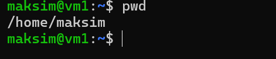
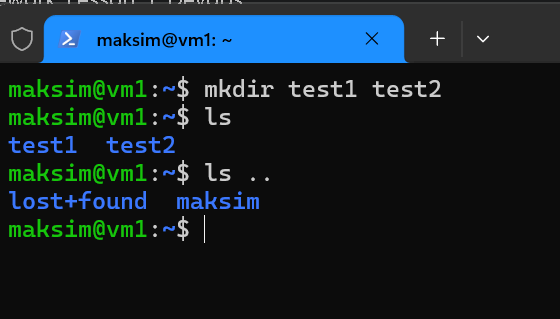
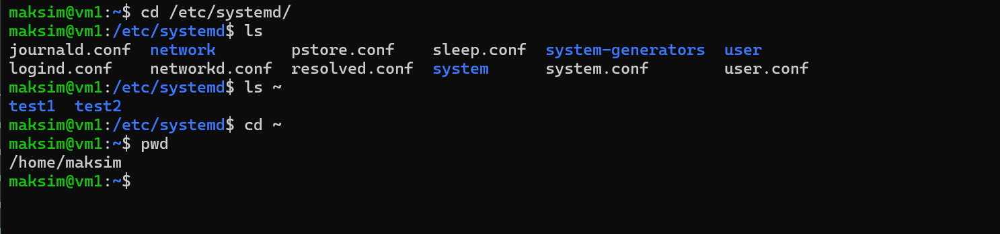
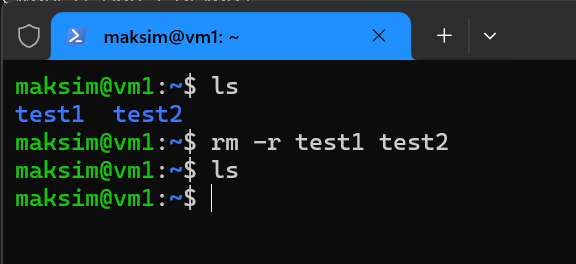
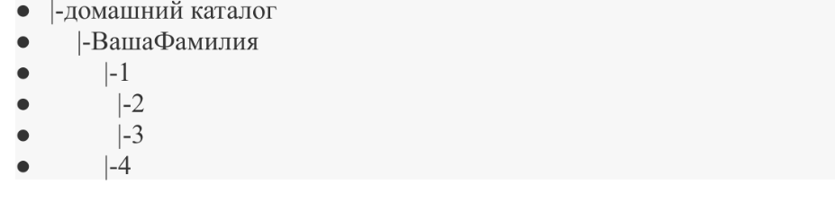
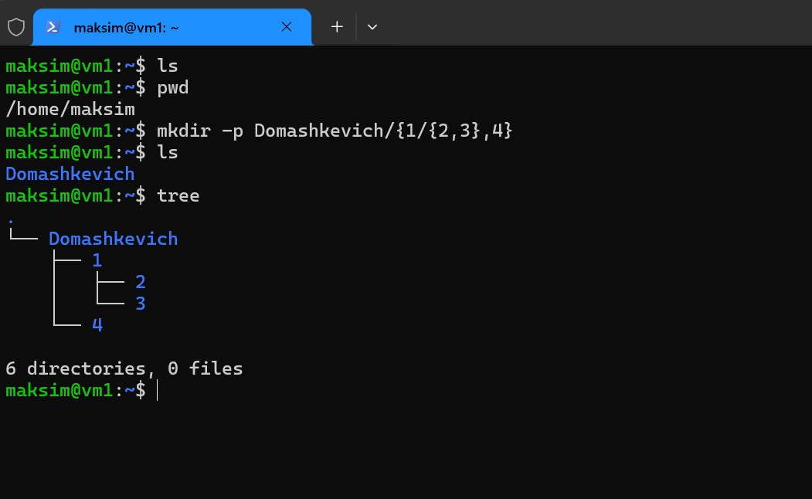

# Работа с директориями в Linux

1. Определяю имя рабочего каталога 
   
   Корневой каталог обозначается знаком "/", получаем, что наше имя рабочего каталога имеет абсолютный начинается со знака "/"home/maksim/
2. Создаю в начальном каталоге два подкаталога. Смотрим  содержимое рабочего каталога. Смотрим содержимое родительского каталога, не переходя в него  
      
3. Перехожу в системный каталог. смотрим его содержимое. Просмотреть содержимое начального каталога. Вернуться в начальный каталог.
   
4. Удаляю созданные ранее подкаталоги.
   
5. Изучил способы запроса для получения информационного блокa по коммандам ls и cd 
    * man ls
    * man cd
    * whatis ls
    * whatis cd
    * apropos ls
    * apropos cd
    * info ls
    * info cd
  
Основное различия в объеме выводимой информации и способе запроса 
* whatis  выводит одну строку из раздела 
* apropos ищет заданное слово по именам и описаниям всех man-страниц и выводит их список 
Все команды из задач 5,6,7 объеднены в 5 блоке 

8. Создаю в домашнем каталоге следующую структуру подкаталогов
    
получаю результат 
    
9. Вывожу первые и последние 13 строк файла /etc/group
    
            
10. Добавляю дополнительный диск к виртуальной машине и провожу процедуру интеграции в текущее дисковое пространство
    