# Домашнее задание №12

1. Создаю подкаталог студента в консоле 
   
    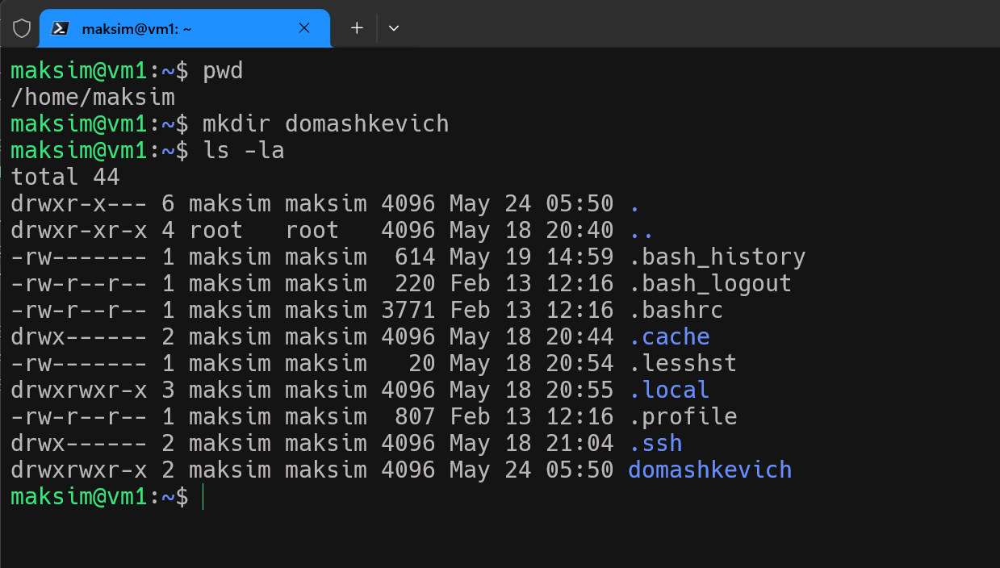

### Задача 1 скрипт запуска  с# файла

2. Создаю 1с файл и прописываю код 

    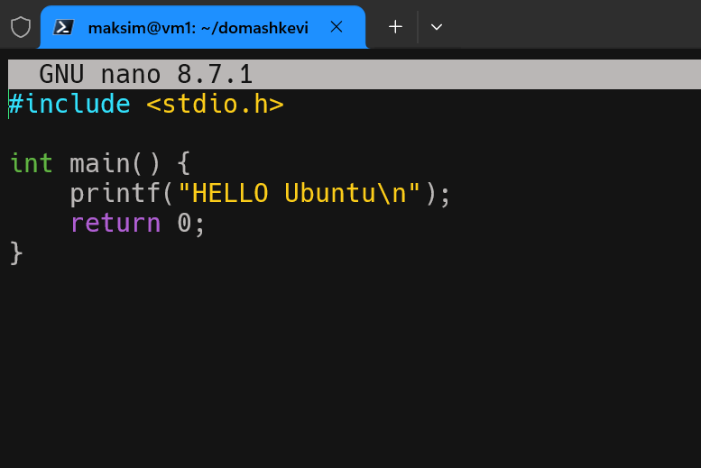

3. Пробую скомпилировать программу
    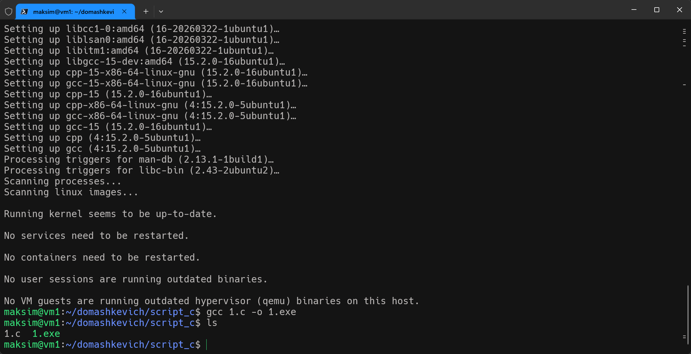

4. Запускаем файл 
    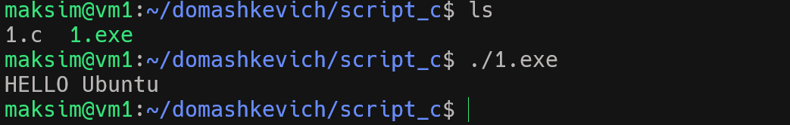

### Задача 2 Выводим на консоль аргументы строки параметров запуска скрипта 

5. Создаю bash файл скрипта "save_arguments.sh" и меняю права файла на исполняемый  
    
    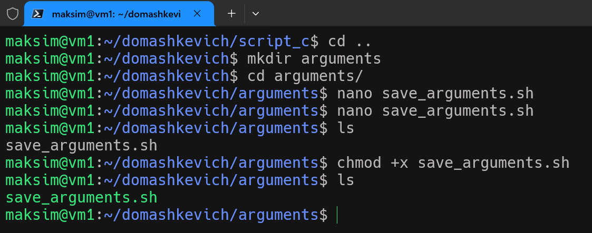

6. Запускаю скрипт с аргументами, проверяю выводяться ли данные и дополнительно сохраняем в файл введенные аргументы.
   
    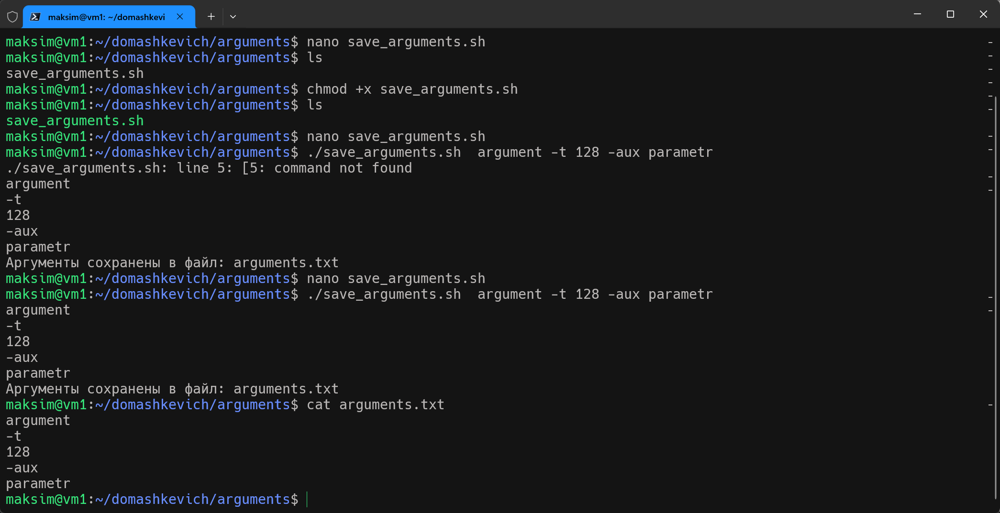

7. Проверяю обработку ошибки на исполнение скрипта без параметров

    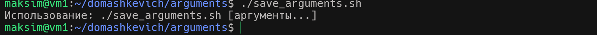       

### Задача 3 Выводим в файл данные файла и окружения с такими же файлами

8. Создаю файл скрипта и меняю права файла на исполняемый 
   
    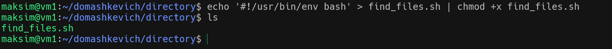

9.  Создаю сет файлов для обработки скриптом
 
    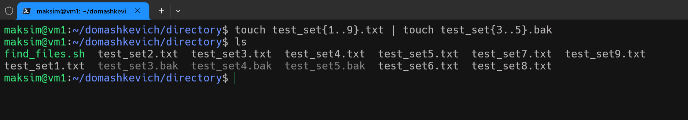

10. Запускаю скрипт дважды с разными параметрами расширения

    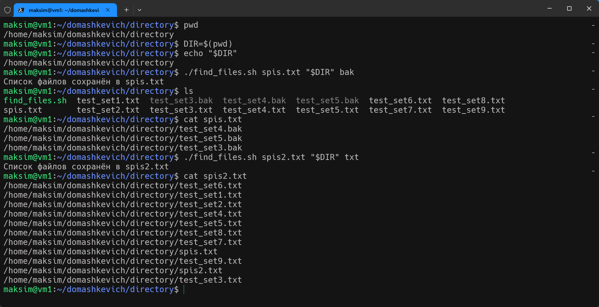 

### Задача 4 Выводим в файл данные окружения с параметрами размер и права

11. Создаю файл скрипта и меняю права файла на исполняемый 

         

12. Запускаю файл скрипта 

    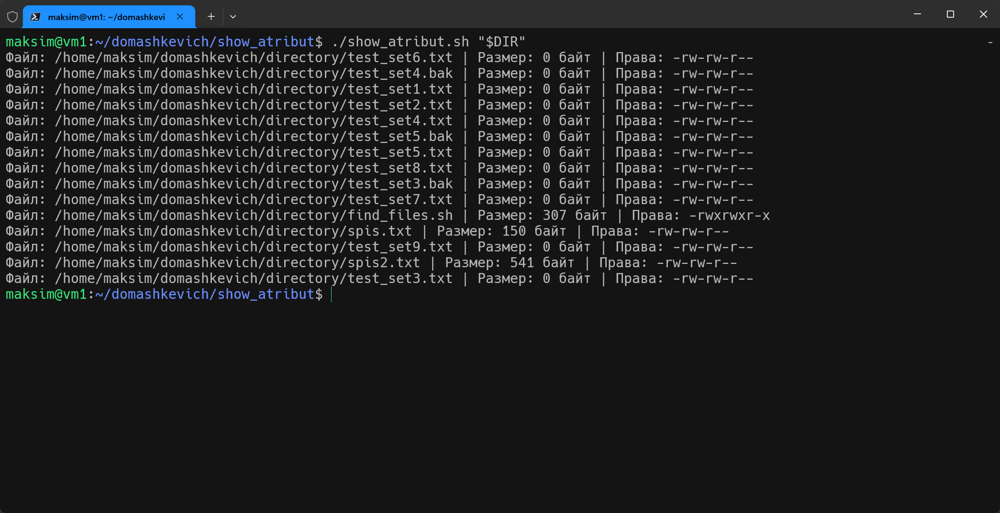   
   

