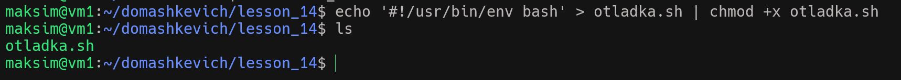
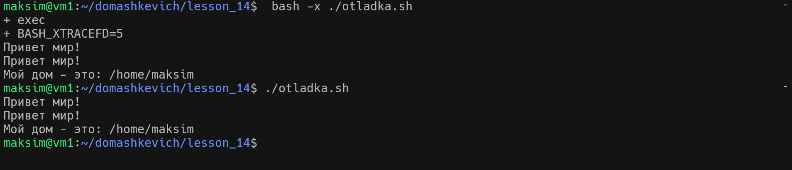
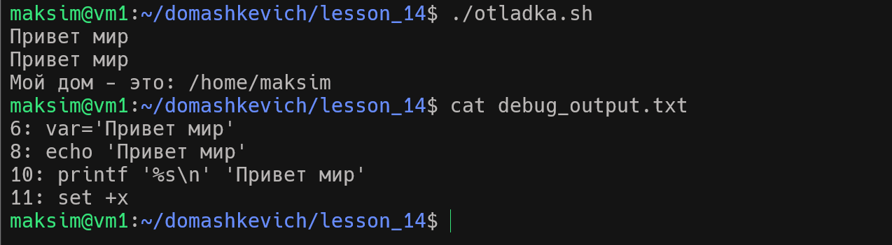
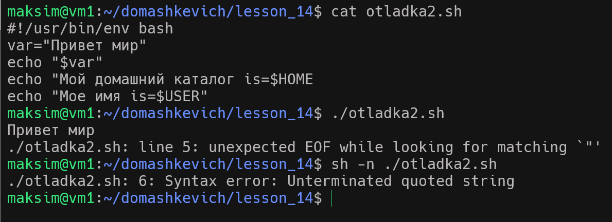
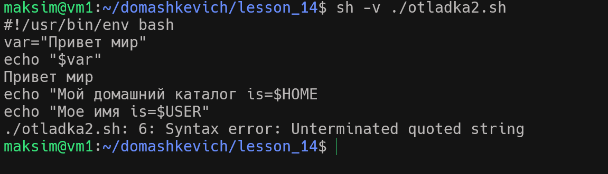

# Домашнее задание №14

1. Используя предоставленные материалы пошагово проверяю структуру и уоманды отладки скрипта.
2. Создаю bash файл скрипта "otladka.sh" и меняю права файла на исполняемый

    
3. Переписываю данные из примера и сравниваю исполнение в обычном режиме и режиме отладки.

       
4. Применяем способ отладки заключенный а между параметрами set -+ x
     
    
5. Продолжаю отладку с параметрами -n  котопый позволит видеть только ошибки
     
              
6. Продолжаю отладку с параметрами -v  который позволит видеть максимум информации
    
    
7.  