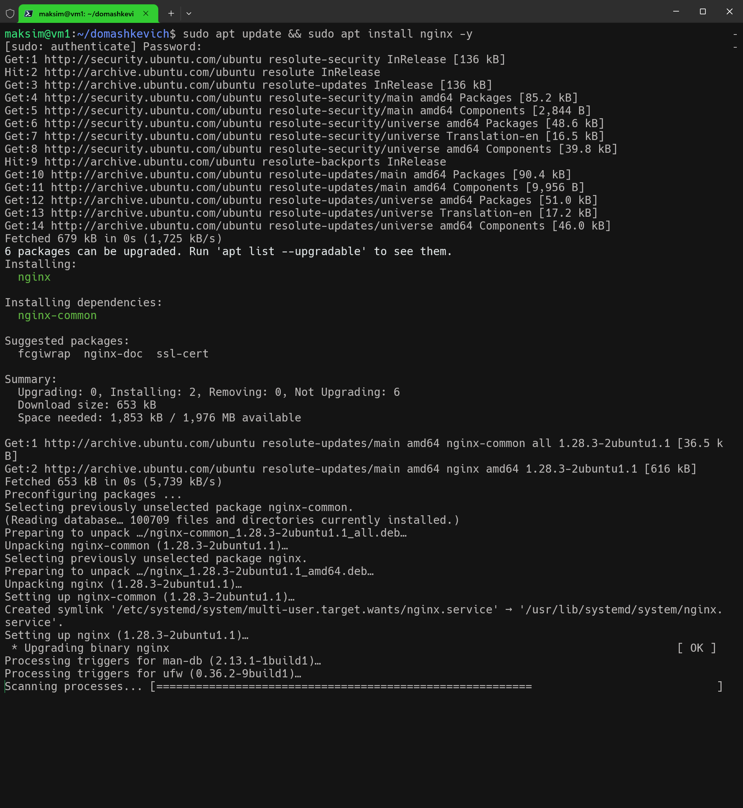
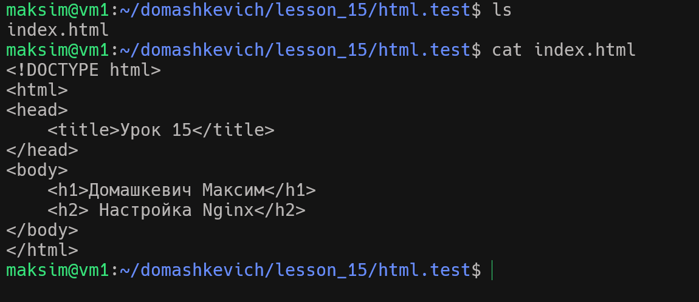
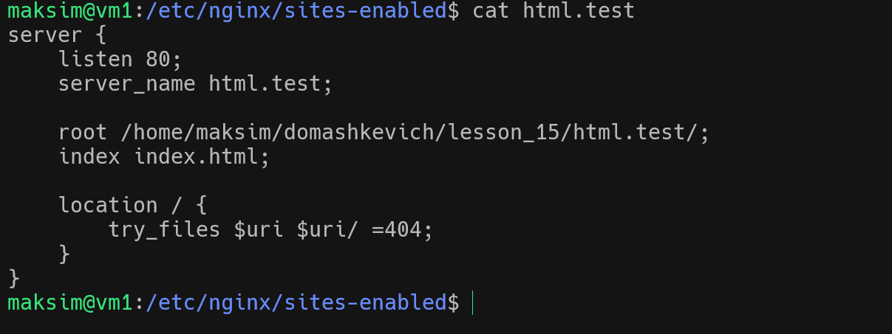
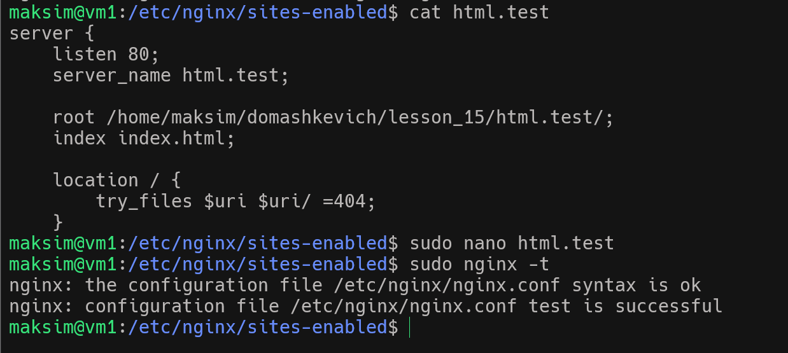
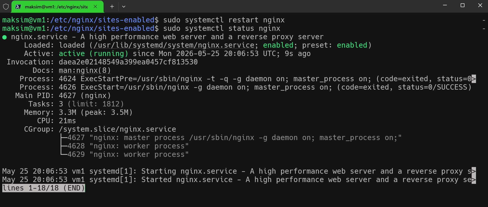

# Домашнее задание №15

1. Устанавливаю вебсервер nginx
   
    

2. Создаю файл HTML для примера
   
     

3. Создаю конфигурацию для nginx и проверяю конфиг

              

     

4. Перезапускаем сервис

     