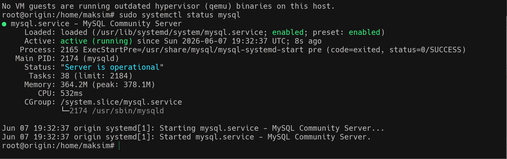
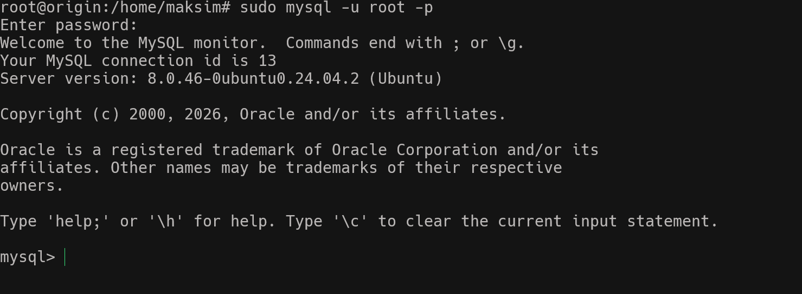
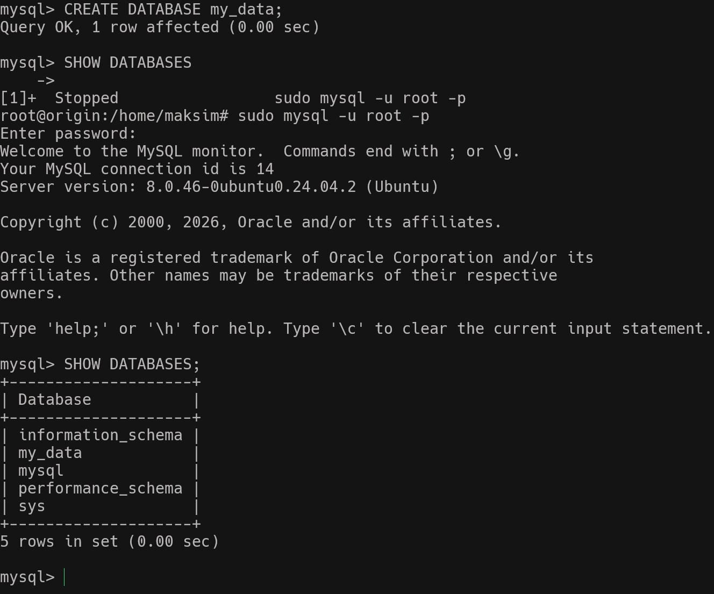
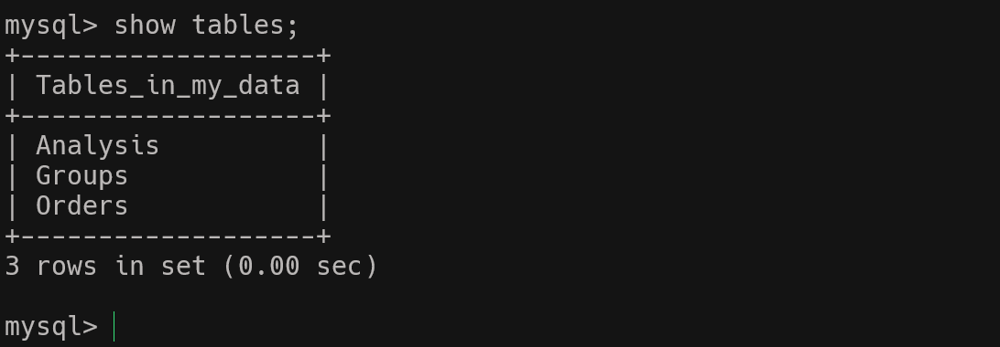
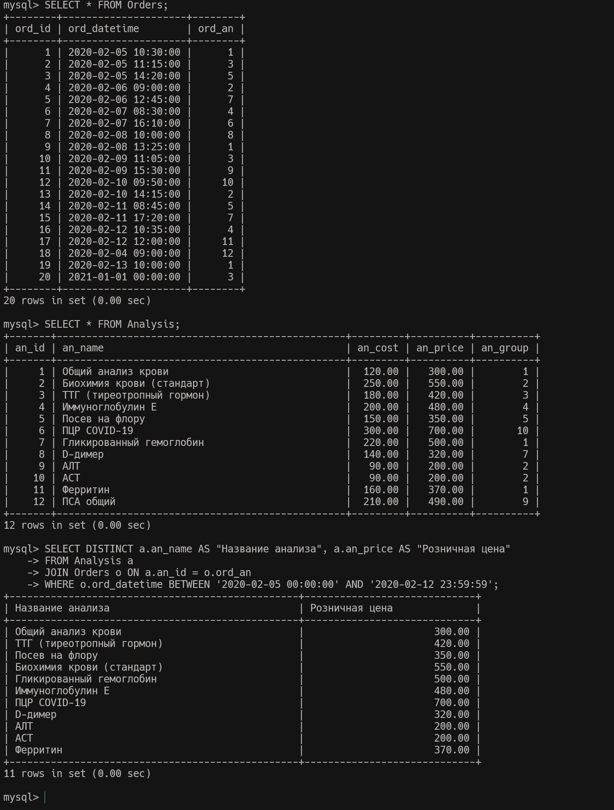

#### Задания №17 
## Установка и использование MySql и работа с БД

1. Устанавливаю MySql на VM и присоединяюсь к базе 
    
    
2. Создаю БД my_data     
    
3. Создаю таюлицы из задания 
    
4. зАполняю таблицу рандомными значениями
       
5. Фоомирую запрос по указанию вывода данных проданных анализов с 5 февраля
           