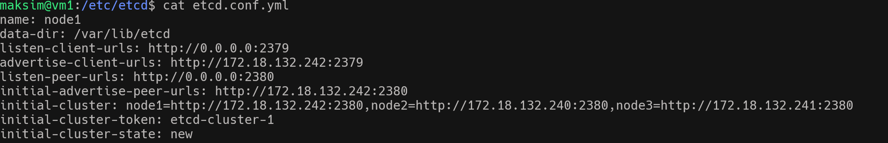
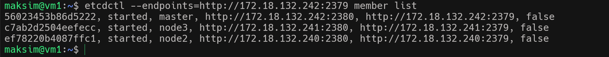
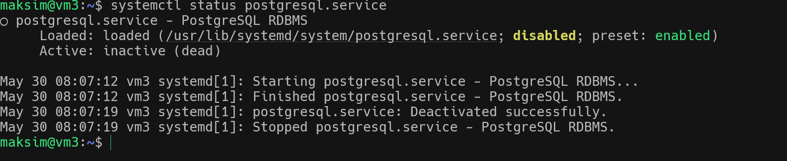
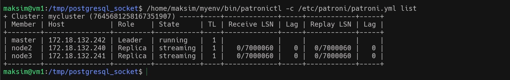

#### Задания №18 
## Цель научиться реализовывать отказоустойчивый кластер PostgreSQL с использованием Patroni на трёх серверах.

1. Устанавливаю дополнительно два сервера VM2, VM3.
2. С помощью iptables прописываю доступы по портам для etcd Postgres и Patroni 
3. Разворачиваю на всех трех платформах Etcd и создаю конфигурационные файлы. Проверяю связность всех кластеров 
    
    
4. Разворачиваю Postgres на всех машинах
    
5. Разварачиваю Patroni и после 8 часов битв и страданий 
       
   