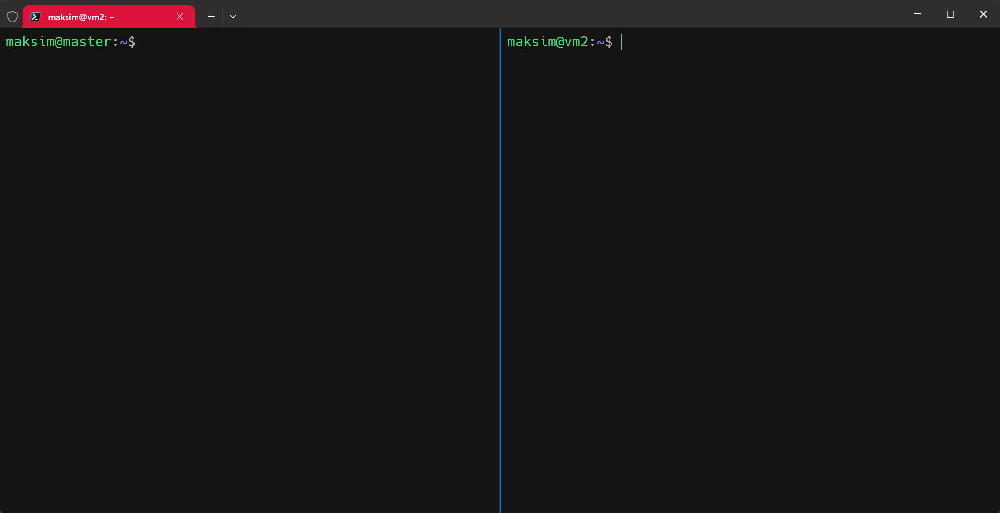
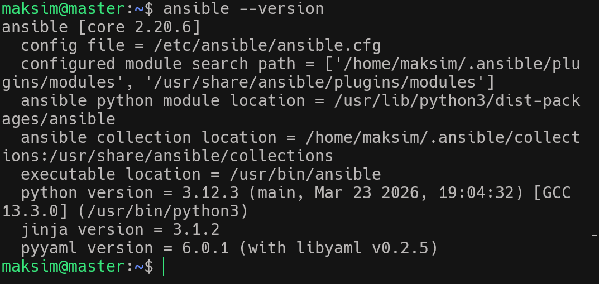
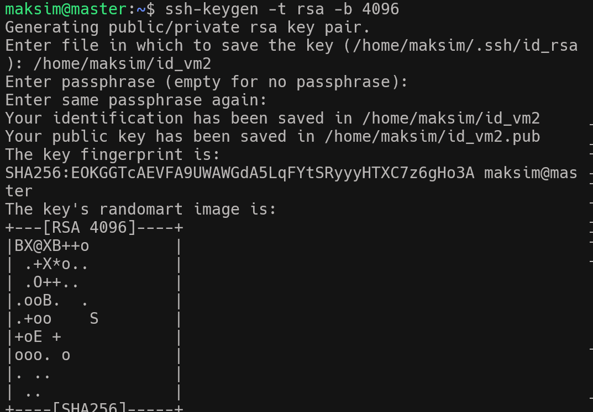
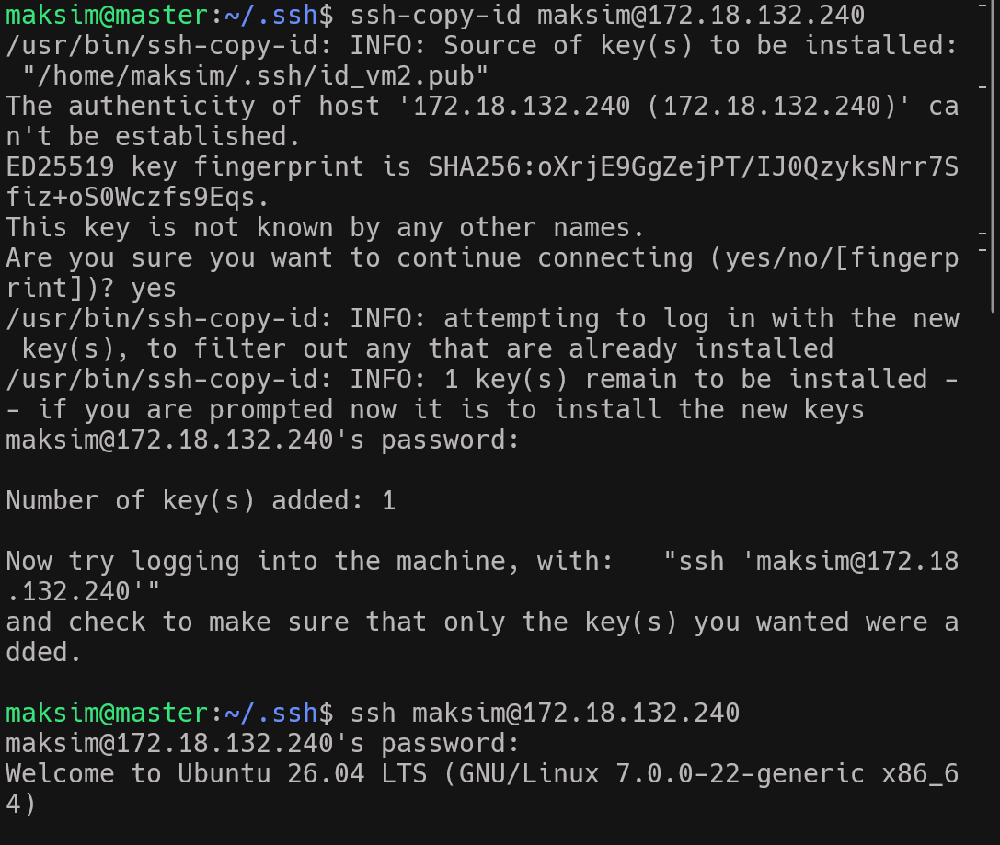
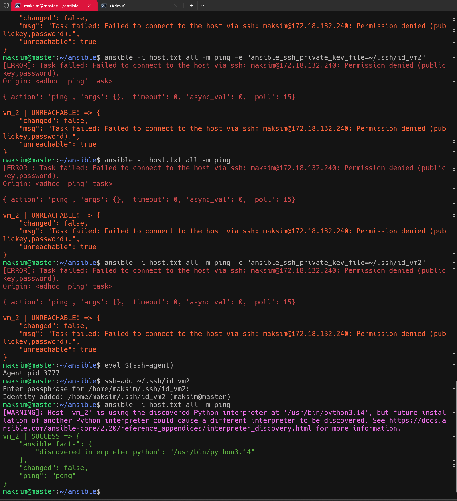

#### Задания №19 
## Цель научиться устанавливать ansible .

1. Разворачиваем две VM мастер и VM_2. VM_2 будет управляться через Ansible с Master server
       

2. Устанавливаю Ansible на мастер сервер
       

3. Создаю SSH на мастере и переношу его на VM_2 и подклюаюсь на VM_2 с mastera
       

        

4. Создаю файл /home/maksim/ansible/hosts.txt и посылаю команду ping с помощью ansible на vm2
              