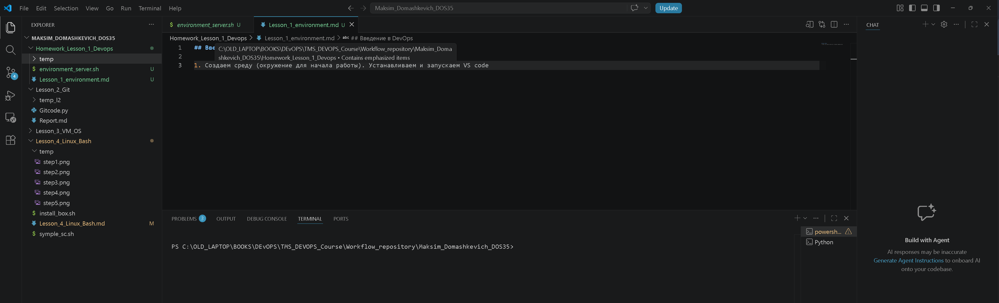
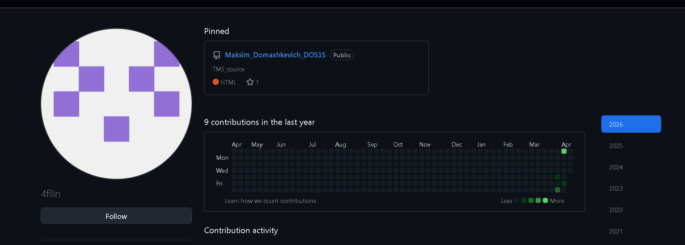
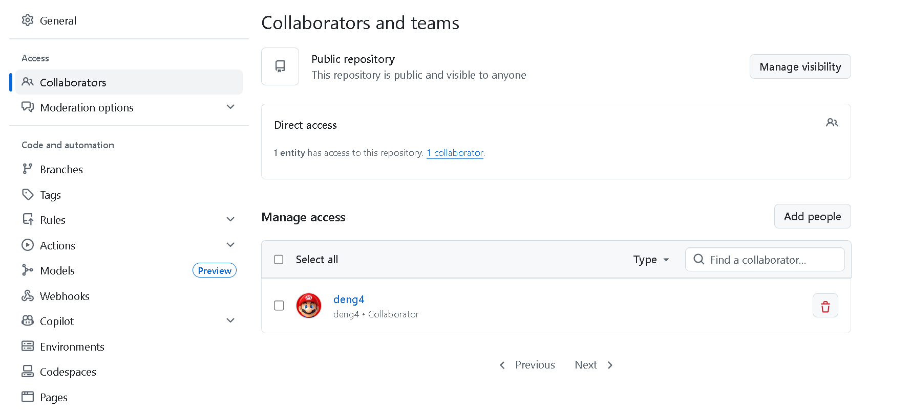
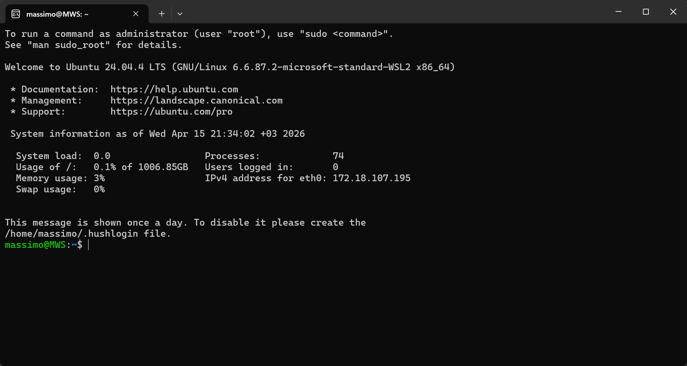

## Введение в DevOps

1. Создаем среду (окружение для начала работы). 
   Устанавливаю и запускаю среду разработки VSС   
    
2. Регистрирую репозиторий на GitHub
    
3. Добавляю преподавателя в с админскими правами доступа
    
4. Устанавливаю WSL на компьютер 
     