## Получить опыт работы с docker командами

### Запуск контейнера с использованием docker run

1. Добавляю репозиторий для docker с помощью скрипта от add_docker_rep.sh
2. Устанавливаю пакеты и проверяем статус docker
   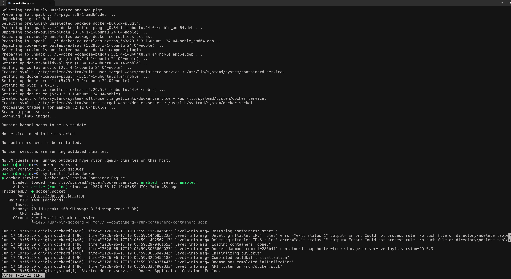
3. Заускаю контейнер Hello World 
   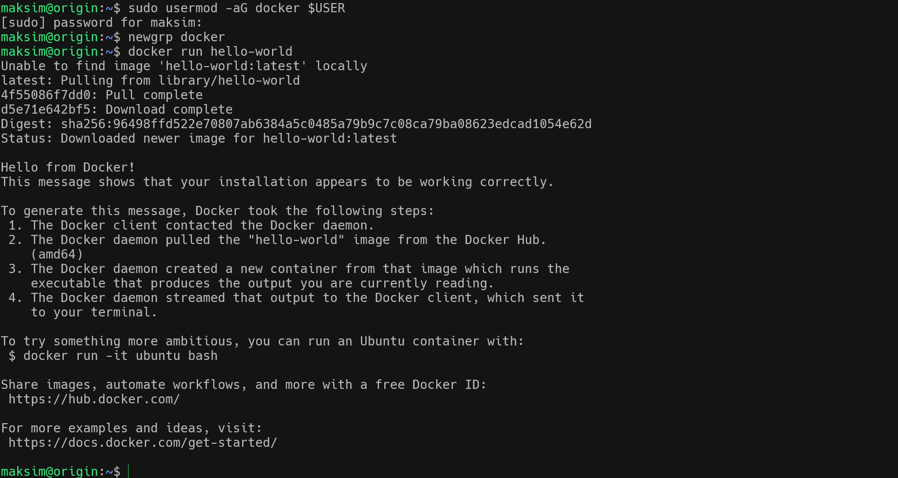
4. Проверяю  список запущенных контейнеров или список всех контейнеров на VM
   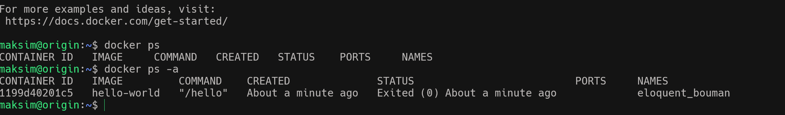 
5. Пробую запустить контейнер с дополнительными параметрами вход в контейнер после запуска  изменяем имя контейнера внутри системы и определяем направление порта       
    "docker run -it --name docker-pocket-ubuntu -p 8080:80  ubuntu:24.04"    
   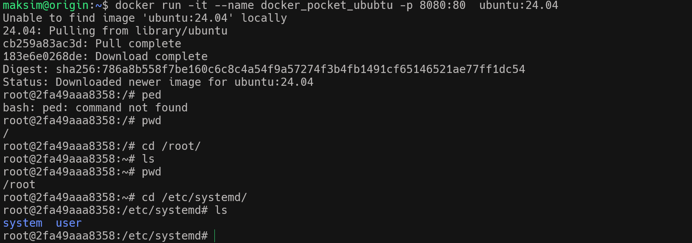     
6. Проверяю команды start/stop/rm/ps   
   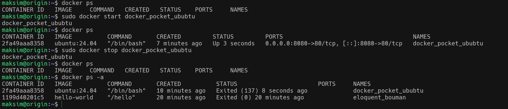    
   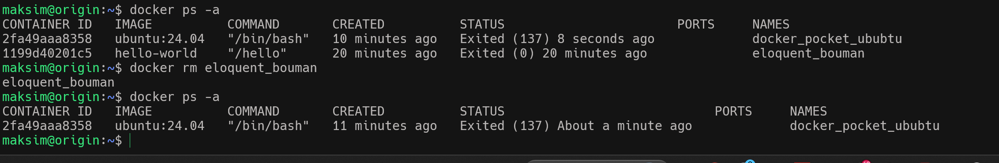
   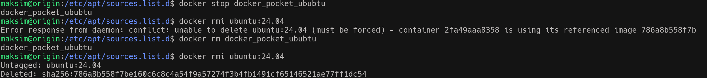

7. Провверяю работу команды docker images 
   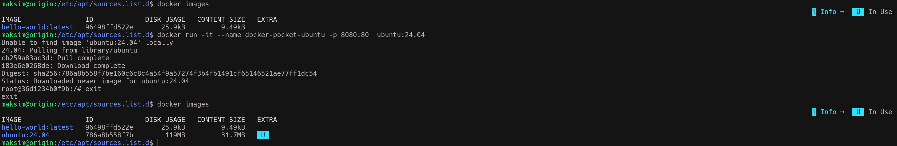
8. Провверяю работу команды docker inspect
   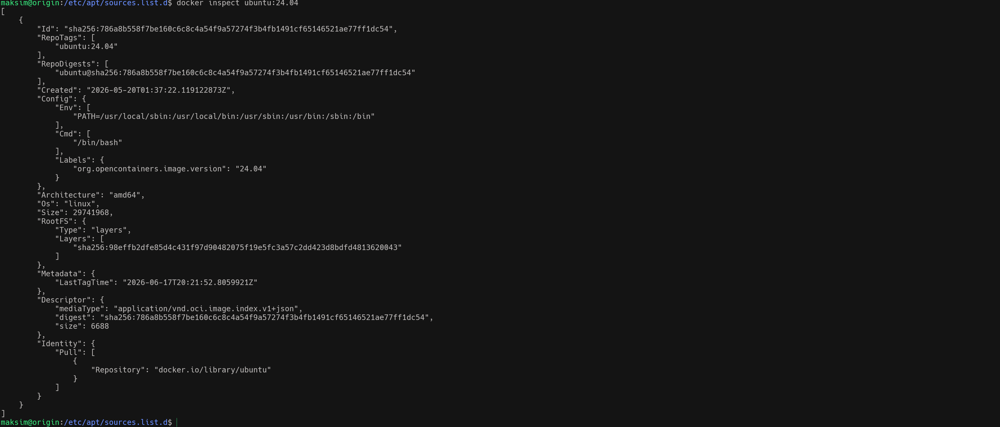
   Проверяю размеры по слоям 
   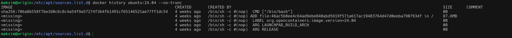

9. Очищаю ненужные данные docker system prune
   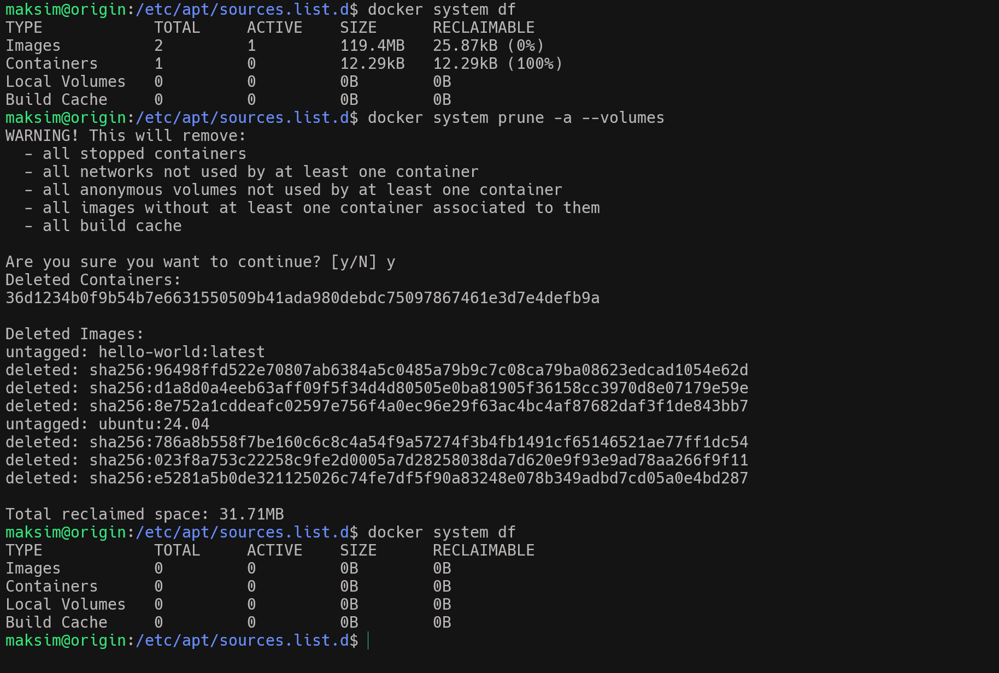       