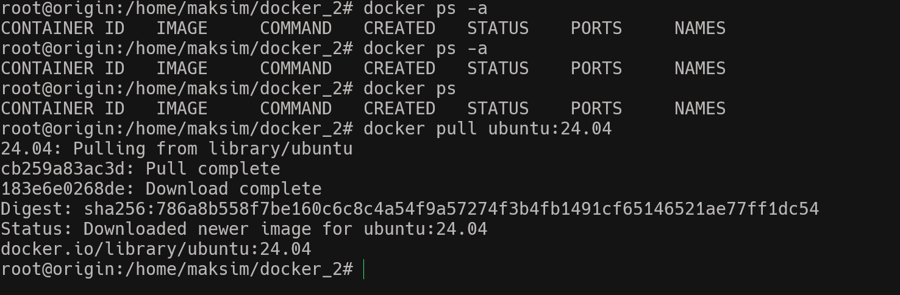
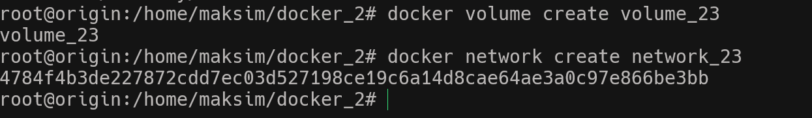
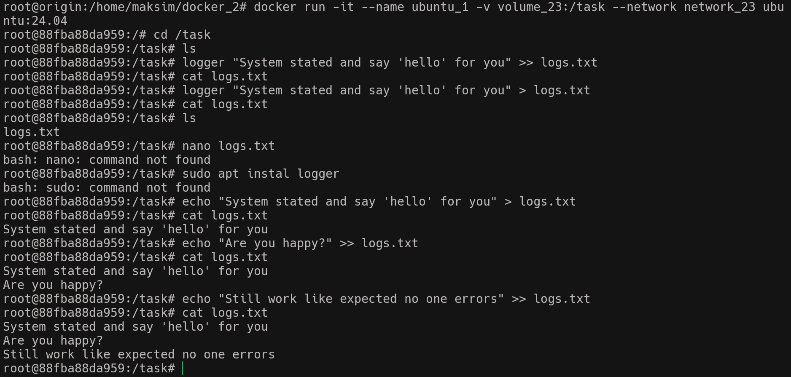
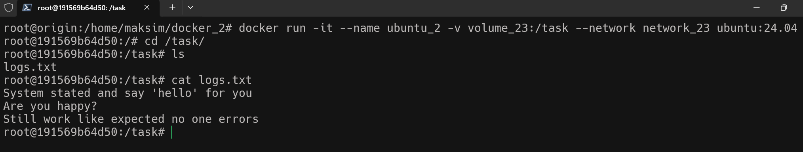
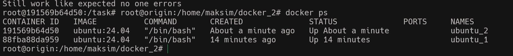
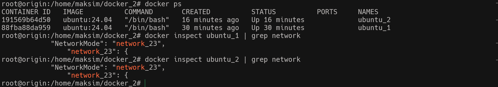
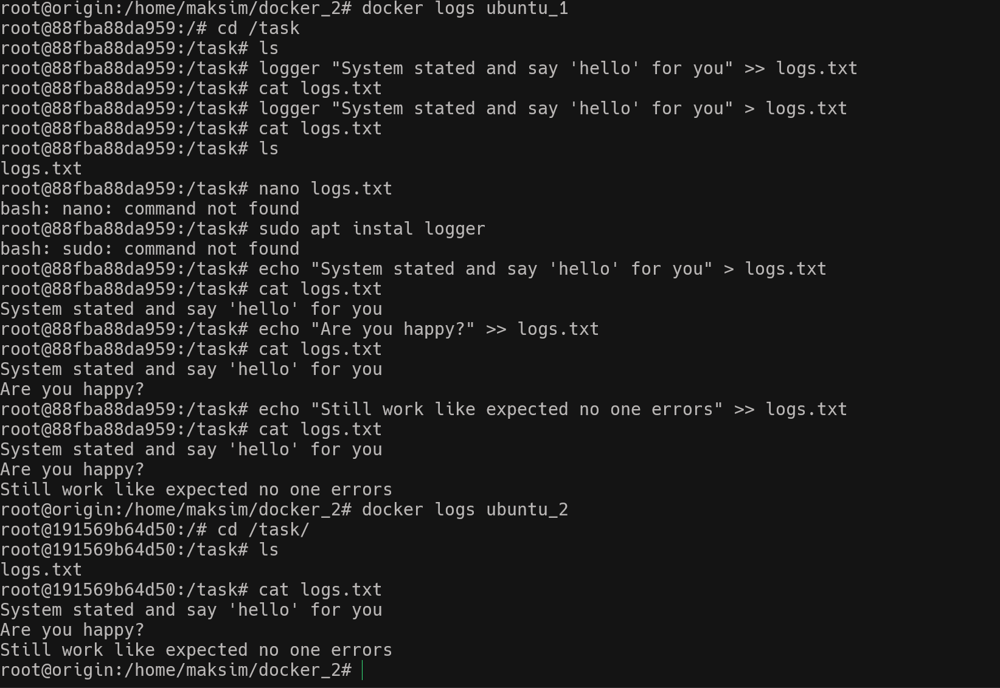
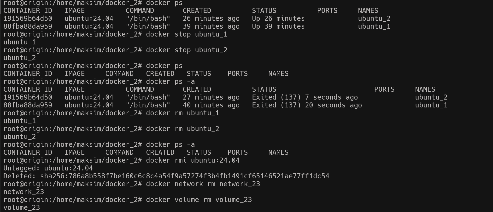

## Цель занятия научиться создавать общий том и общую сеть для двух докер контейнеров
1. Скачиваю контейнер ubuntu 24.04
   
2. Создаю том volume_23 и сеть network_23
          
3. Запускаю первый контейнер с ubuntu и монтирую к нему наш созданый том и сеть
   "docker run -it --name ubuntu_1 -v volume_23:/task --network network_23 ubuntu:24.04"
        
4. Запускаю второй контейнер с ubuntu и монтирую к нему наш созданый том и сеть. Проверяю что том доступен из второго контейнера и содержит ранее записанную информацию 
   "docker run -it --name ubuntu_2 -v volume_23:/task --network network_23 ubuntu:24.04"
    
5. Выхожу из контейнера проверяю что они оба запущены и работают
                
6. Проверяю что контейнеры запущены в одной сети 
         
7. Проверяю работу команды docker logs
    
8. Останавливаю и очищаю систему от контейнеров и образа. Удаляю сеть и том. 
       