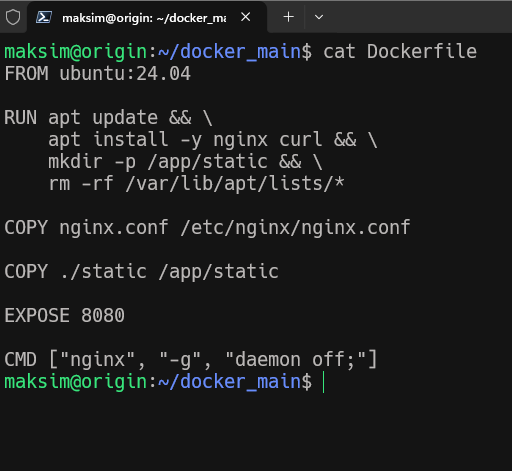
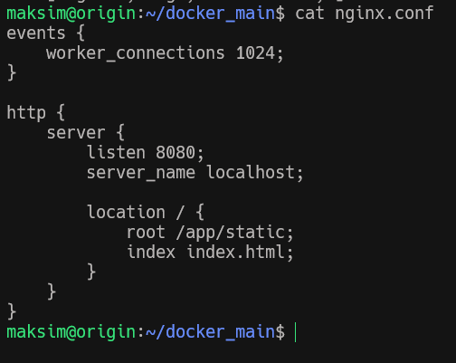
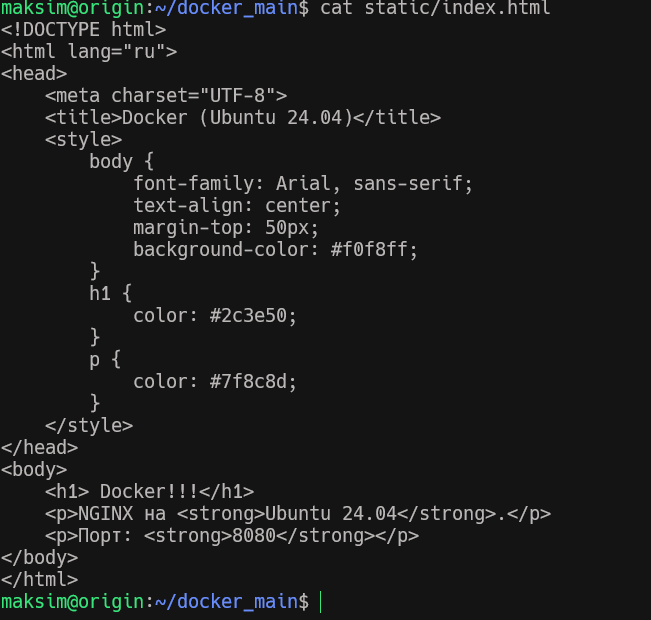
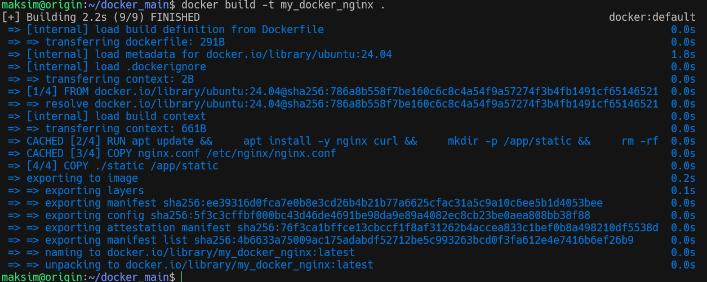
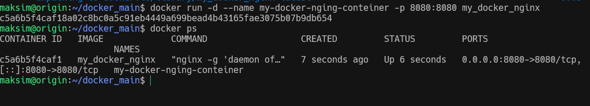
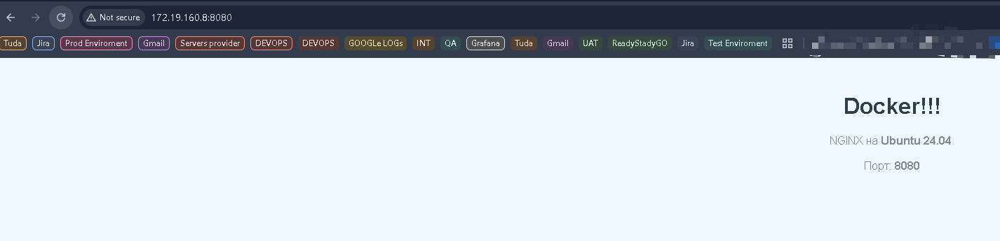
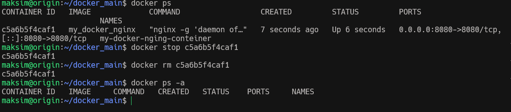

## Цель занятия научиться создавать docker вручную и создание связности с docker_compose
1. Создаю файл docker Docker_nginx и заполняю его командами 
   
2. Создаю файл конфигурации nginx
   
3. Создаю файл Html     
   
4. Собираю докер образ
             
5. Запускаю контейнер
   
6. Проверяю 
    
7. Останавливаю и удаляю контенер 
             