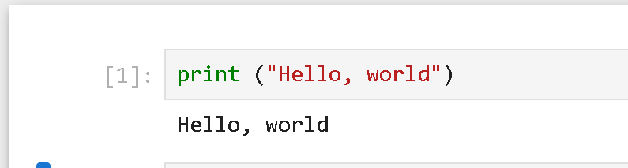
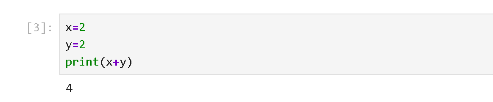
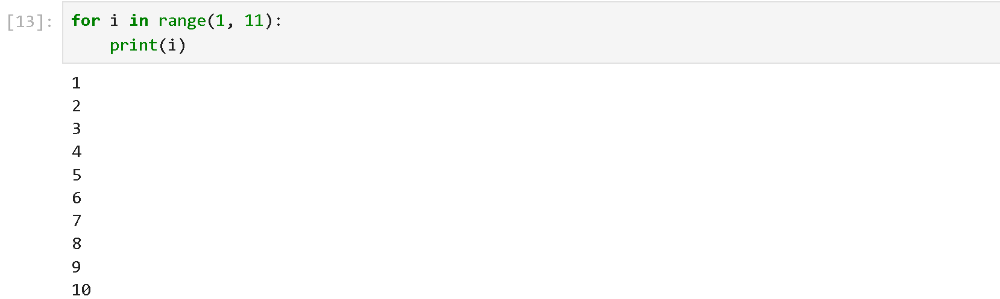
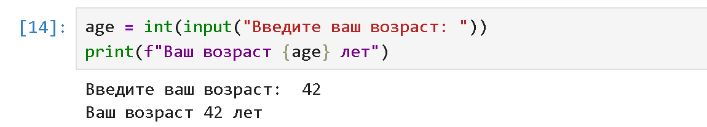
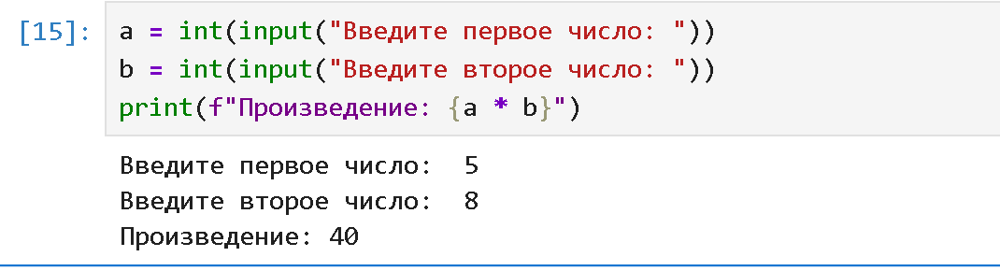
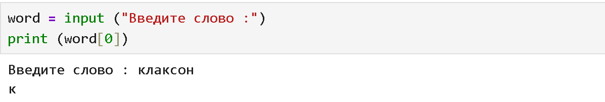
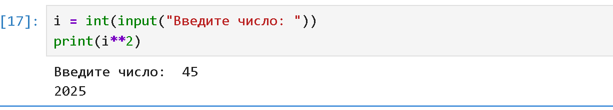
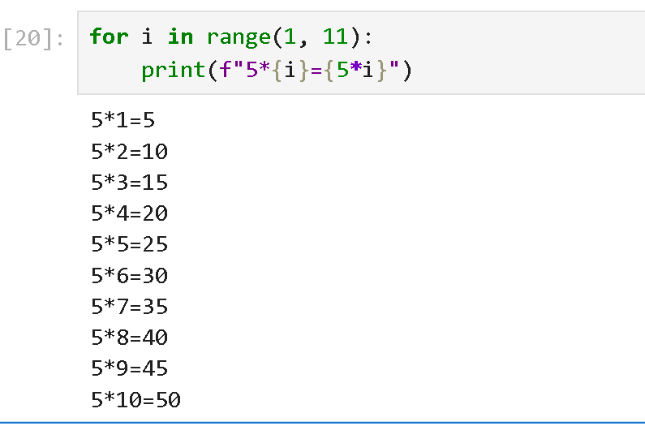
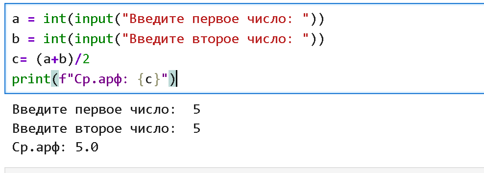

## Цель занятия изучить типы данных Python и научиться базовому написанию кода

1. Напишите программу, которая выводит на экран фразу "Привет, мир!".
      
2. Напишите программу, которая выводит на экран результат вычисления 2+2
      
3. Условие: Напишите программу, которая запрашивает у пользователя его имя и выводит на экран сообщение "Привет, [имя]!"
      
4. Напишите программу, которая выводит на экран числа от 1 до 10
         
5. Напишите программу, которая запрашивает у пользователя его возраст и выводит на экран сообщение "Ваш возраст [возраст] лет".
         
6. Напишите программу, которая запрашивает у пользователя два числа и выводит на экран их произведение.
                 
7. Напишите программу, которая запрашивает у пользователя слово и выводит на экран его первую букву.
         
8. Напишите программу, которая запрашивает у пользователя целое число и выводит на экран его квадрат.
         
9. Напишите программу, которая выводит на экран таблицу умножения на число 5
         
10. Напишите программу, которая запрашивает у пользователя два числа и выводит на экран их среднее арифметическое.
         