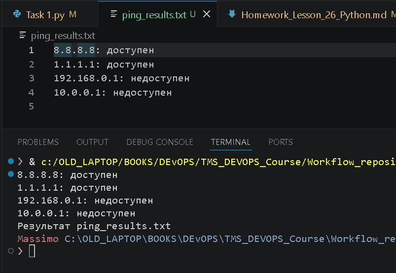
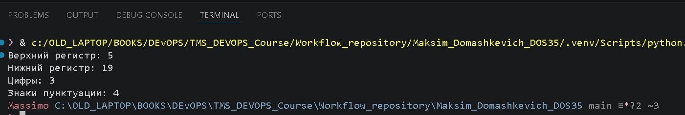
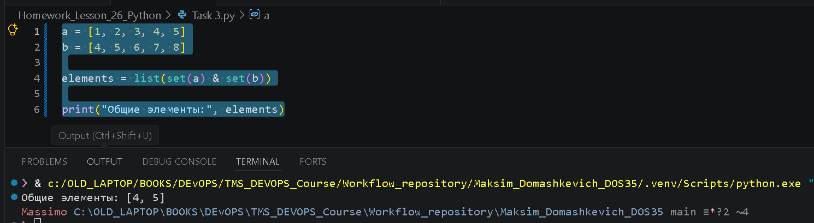
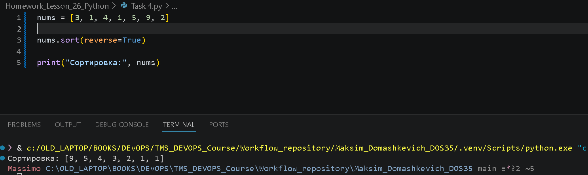
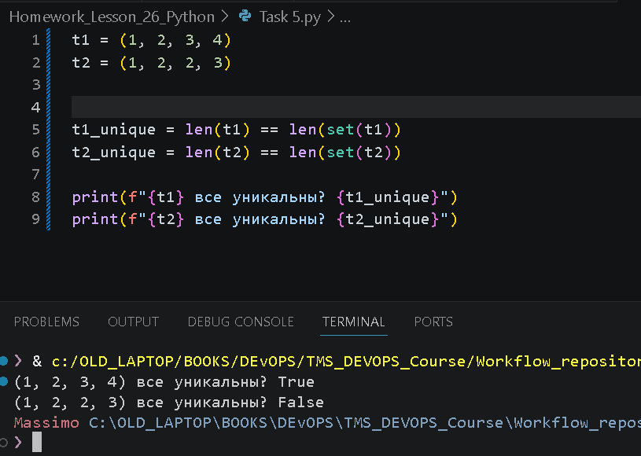
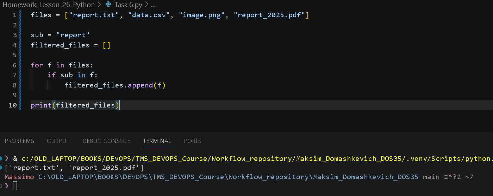
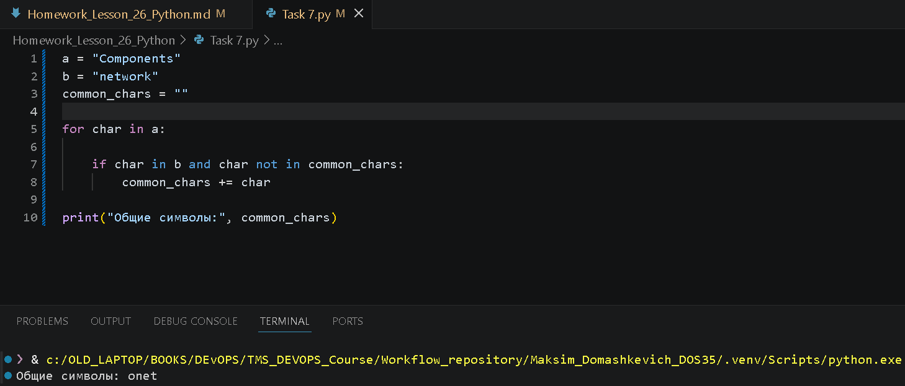
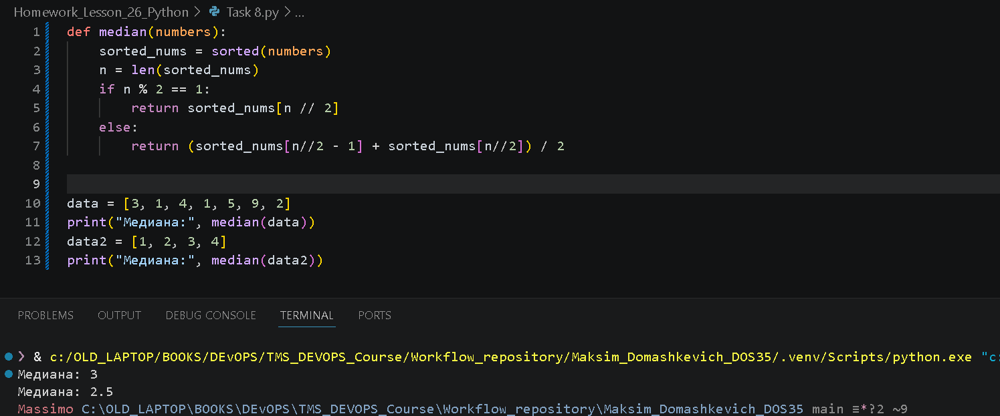

## Цель занятия изучить типы данных Python и научиться базовому написанию кода

1. Задача 1. 
   Скрипт принимает список IP-адресов, проверяет их ping-доступность и сохраняет результаты в файл ping_results.txt.
    Результат выполнения файл Task1.py 
          

2. Задача 2.
   Скрипт принимает строку и выводит количество: букв верхнего регистра, нижнего регистра, цифр, знаков пунктуации.
    Результат выполнения файл Task2.py 
          
3. Задача 3.
   Скрипт принимает два списка и выводит элементы, которые присутствуют в обоих.
    Результат выполнения файл Task3.py 
          

4. Задача 4.
   Скрипт принимает список чисел и сортирует его в порядке убывания.
    Результат выполнения файл Task4.py 
          

5. Задача 5.
   Скрипт принимает кортеж и проверяет, все ли его элементы уникальны.
    Результат выполнения файл Task5.py 
          

6. Задача 6.
   Скрипт принимает список имён файлов и подстроку, возвращает файлы, содержащие эту подстроку.
    Результат выполнения файл Task6.py 
          

7. Задача 7.
   Скрипт принимает две строки и выводит все символы, которые встречаются в обеих строках.
    Результат выполнения файл Task7.py 
         

8. Задача 8.
   Скрипт принимает список чисел и находит медиану.
    Результат выполнения файл Task8.py 
           

