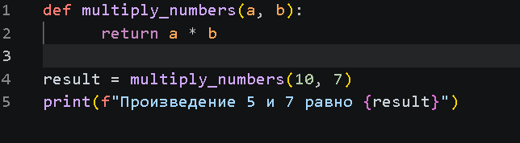
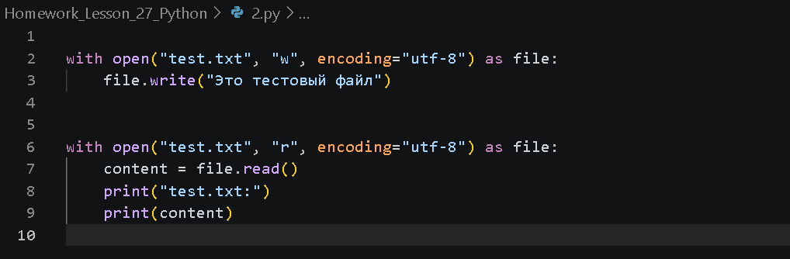
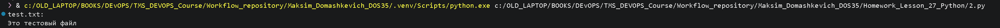
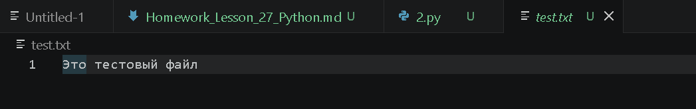
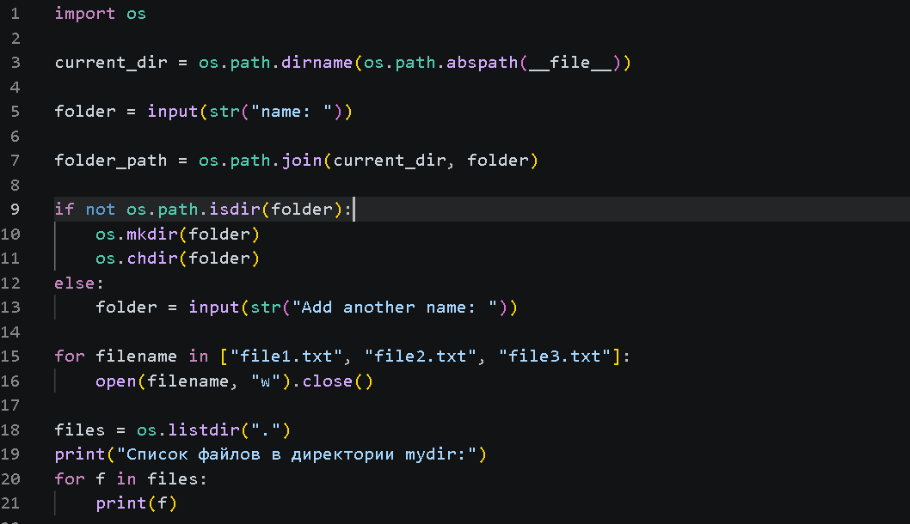
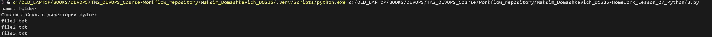
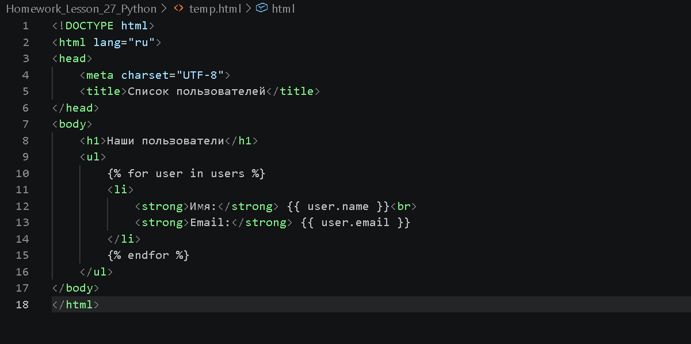
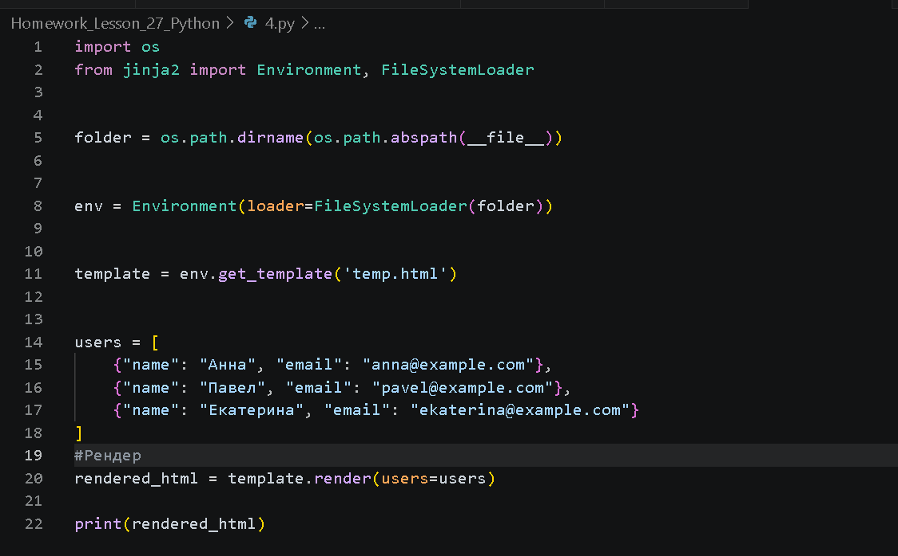
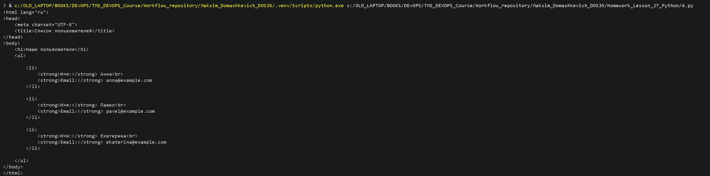

## Цель проверить на практите применение функций работу с файлами и директориями а также работу с шаблонизатором Jinja

1. Пишу функцию multiply_numbers(), которая принимает два аргумента и возвращает их произведение. Затем вызываю эту функцию и вывожу результат на экран.
2. Описанный код в файле 1.py
      
3. Результат выполнения
       
   
4. Создаю файл test.txt. Записываю в него строку "Это тестовый файл". Открывю  файл в режиме чтения и вывожу результат на экран.
5. Описанный код в файле 2.py
      
6. Результат выполнения 
      
            

7. Создаю пустую директорию mydir в текущей рабочей директории. Затем  создайю в ней три пустых файла: file1.txt, file2.txt и file3.txt. Вывожу список файлов из директории на экран.
8. Описанный код в файле 3.py
      
9.  Результат выполнения 
          
10. Создаю шаблон temp.html, который будет содержать HTML-код для отображения списка пользователей. Использую цикл for для перебора элементов списка, и вывожу имя и email каждого пользователя. Создаю список пользователей в виде списка словарей, передаю его в шаблон и вывожу результат на экране.
11. Описанный код в файле 4.py
        
              
12. Результат выполнения 
        