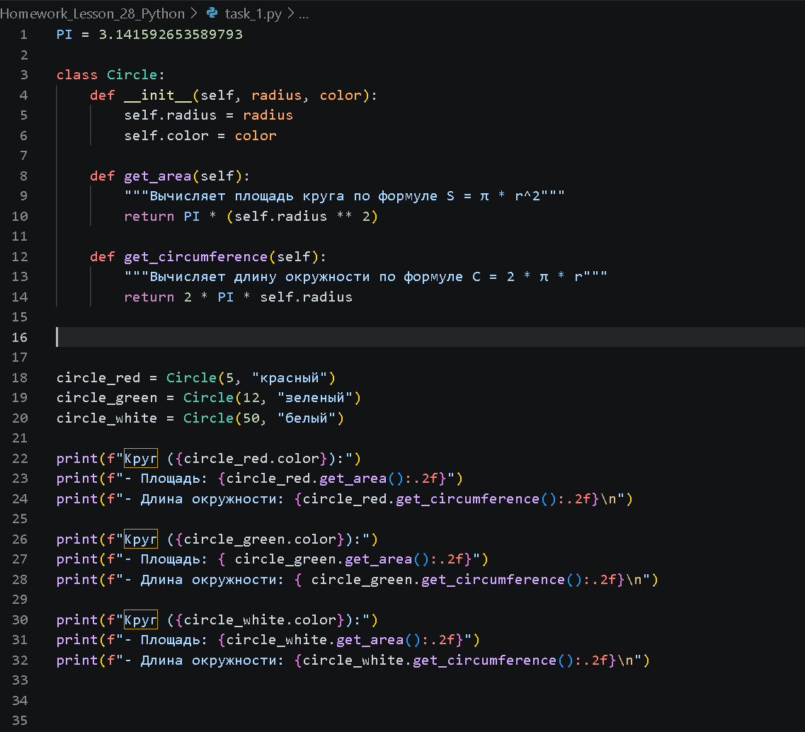

## Цель проверить на практите применение ООП реализовать задачу с созданием и использованием классов и методов ООП 

1. Задача Создать класс Круг, который имеет атрибут радиуса и цвета а также методы для вычисления площади и длины окружности.
2. Описываем код в файле Task1.py 
      
3. Проверяем результаты запуска кода
      