##AWS и основы работы с TerraForm

1. Регистрируем аккаунт в AWS.
        
2. Подключаю CLI для возможеости управления из консоли
        
3. Создаю SSH ключи для последующего доступа к создаваемым в AWS компонентам и проверяю наличие ключа в AWS UI инфраструктуре.    
      aws ec2 create-key-pair --key-name StadyAws --query 'KeyMaterial' --output text > StadyAws.pem
      
              
4. Создаю Security Group и добавляю возможность коннекта к инстансу через 22 порт
      aws ec2 create-security-group --group-name MyStudyGroup --description "MyStudyGroup"
      
          
      
      aws ec2 authorize-security-group-ingress --group-id sg-01f1ff2cd56a95033 --protocol tcp --port 22 --cidr 0.0.0.0/0
      
      
            
5. Создаю VM вместе с дополнительным томом EBS и добавлением предыдущих параметров SSH и Security Group
   
      aws ec2 run-instances --image-id ami-01b91d3cd0dd501ff --count 1 --instance-type t2.micro --key-name StadyAws --security-group-ids sg-01f1ff2cd56a95033 --block-device-mappings '[{"DeviceName":"/dev/xvdf","Ebs":{"VolumeSize":5,"VolumeType":"gp2"}}]
      
          
          
                

6. Подключаюсь к инстансу со своей машины
      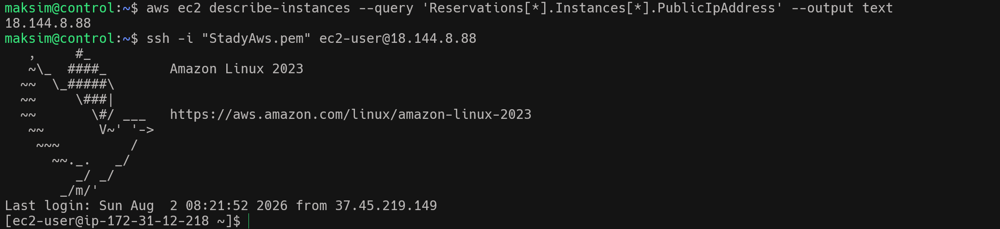
      также  проверяю через lsblk что к VM подключены два диска 
       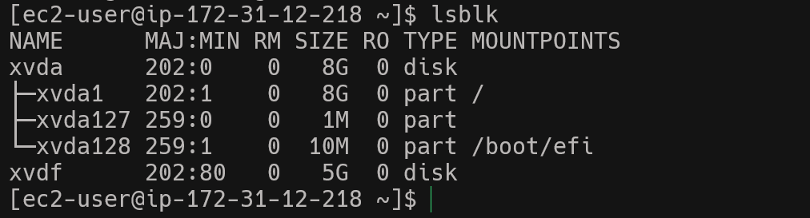
    
## Создание S3 бакета и загрузка файла 
1. Создаю бакет S3 
      aws s3 mb s3://maksim-study-bucket --region us-west-1
       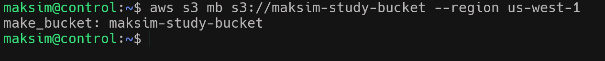
       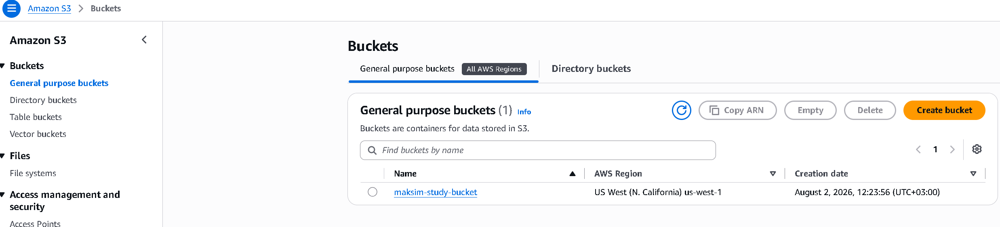
2. Создаю и преедаю в бакет несколько файлов
       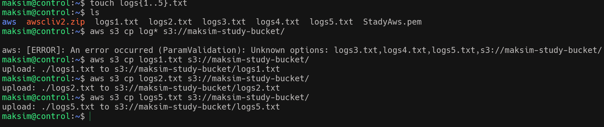      
3. Проверяю наличие файлов
       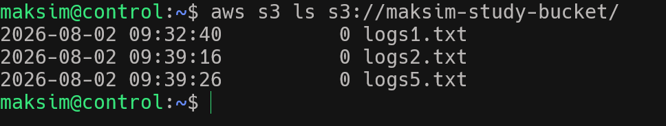 
       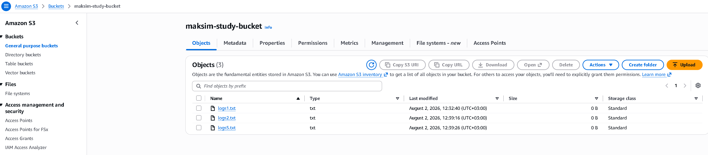 

## Создание RDS 

1. Добавляю к Sequrity Group возможность доступа к RDS по порту 3306
   
      aws ec2 authorize-security-group-ingress --group-id sg-01f1ff2cd56a95033 --protocol tcp --port 3306 --cidr 0.0.0.0/0

      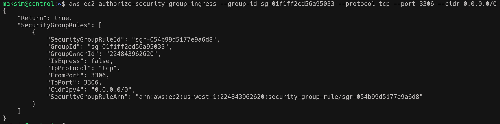 
      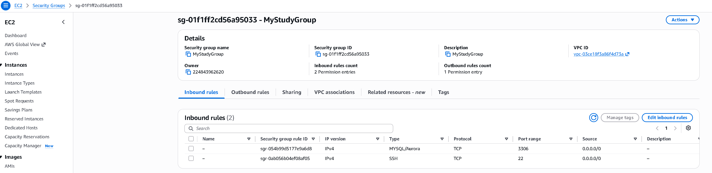 
2. Создаю RDS инстанс

      aws rds create-db-instance --db-instance-identifier stadydb --db-instance-class db.t3.micro --engine mysql --master-username admin --master-user-password Password123 --allocated-storage 5 --publicly-accessible --vpc-security-group-ids sg-01f1ff2cd56a95033
      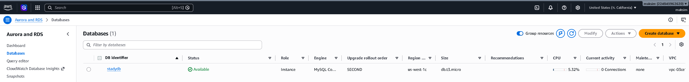
3. Создаем резервирование для DB
      aws rds create-db-snapshot --db-instance-identifier stadydb --db-snapshot-identifier stadydbsnapshot
      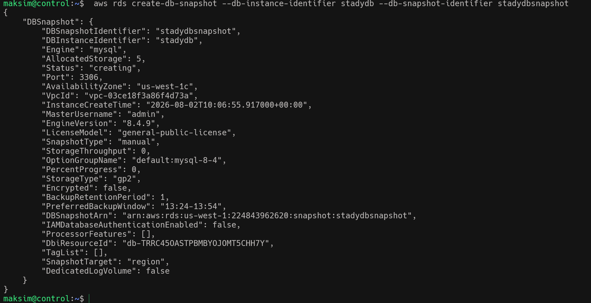
      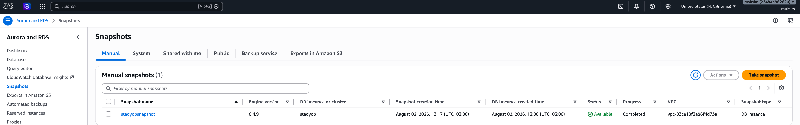

4. Востановление DB
      aws rds restore-db-instance-from-db-snapshot --db-instance-identifier stadydb-restored --db-snapshot-identifier stadydbsnapshot 
      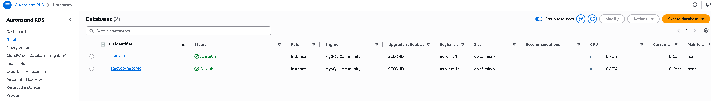
5. Проверяю подключение к DB
      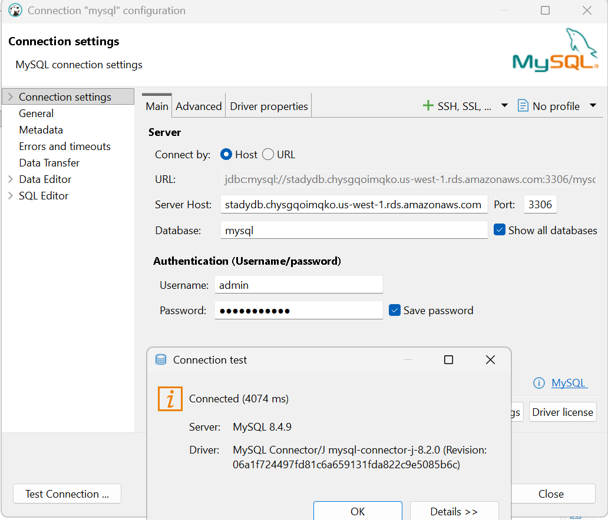  