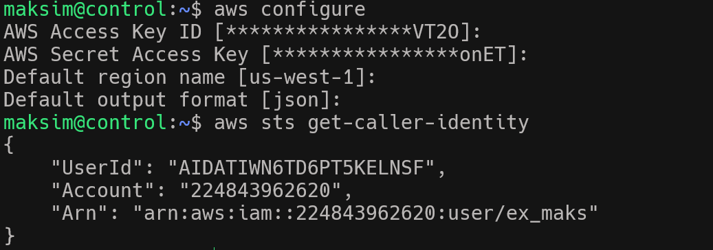
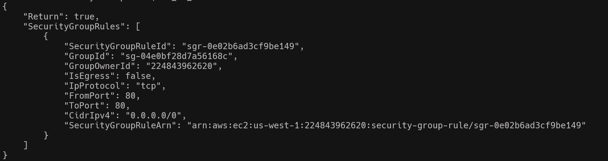
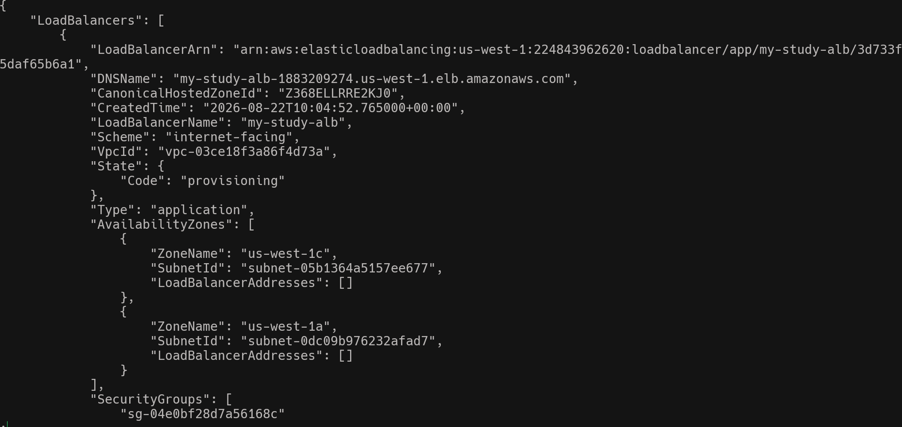
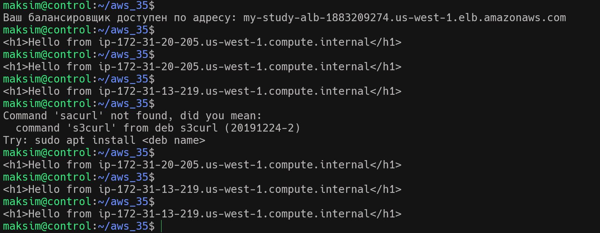

### Знакомство с инфраструктурой AWS Elastic load balanser(ELB), Auto scaling Group (ASG) и Amazon route 53.

1. Проверяю подключение к AWS CLI 
      
2. Создаю SG для Load Balanser
   ``` ALB_SG_ID=$(aws ec2 create-security-group --group-name "study-alb-sg" --description "SG for LB" --vpc-id     $VPC_ID --query 'GroupId' --output text)
    aws ec2 authorize-security-group-ingress --group-id $ALB_SG_ID --protocol tcp --port 80 --cidr 0.0.0.0/0 
    ```
          
3. Создаю  SG для EC2 instance и подключаем трафик только от группы балансировщика
   ```
   EC2_SG_ID=$(aws ec2 create-security-group --group-name "study-ec2-sg" --description "SG for EC2 instances" --vpc-id $VPC_ID --query 'GroupId' --output text)
   aws ec2 authorize-security-group-ingress --group-id $EC2_SG_ID --protocol tcp --port 80 --source-security-group-id $ALB_SG_ID
   ```
4. Создаю домен для Route 53 
    DOMAIN_NAME="dos35study.com"

5. Создаю Target Group 
    ```  
    aws elbv2 create-target-group \
    --name mystudy-tg \
    --protocol HTTP \
    --port 80 \
    --vpc-id $VPC_ID \
    --health-check-path "/" \
    --health-check-interval-seconds 30
    ```
6. Создаю LB и подключаю к нему группу SG созданную ранее а также добавляю подсети
    ```
   aws elbv2 create-load-balancer \
    --name my-study-alb \
    --subnets $SUBNETS \
    --security-groups $ALB_SG_ID
    ```

   
  
7. Создаю  Auto scaling Group (ASG)
```
    aws autoscaling create-auto-scaling-group \
    --auto-scaling-group-name my-study-asg \
    --launch-template LaunchTemplateName=my-launch-template \
    --vpc-zone-identifier $SUBNETS \
    --min-size 2 \
    --max-size 4 \
    --target-group-arns $TG_ARN
```
Опционально можно добавлять варианты политик использования 
 ```
    aws autoscaling put-scaling-policy \
    --auto-scaling-group-name my-asg \
    --policy-name cpu-scaling-policy \
```
8. Создаю управление DNS
```
aws route53 create-hosted-zone \
    --name $DOMAIN_NAME \
    --caller-reference $(date +%s)
```      
9. Создаем файл который будет управлять трафиком и направляем 100 % трафика на балансировщик
```
{
  "Changes": [
    {
      "Action": "CREATE",
      "ResourceRecordSet": {
        "Name": "test.$DOMAIN_NAME",
        "Type": "A",
        "SetIdentifier": "Primary-ALB",
        "Weight": 100,
        "AliasTarget": {
          "DNSName": "dualstack.$ALB_DNS",
          "EvaluateTargetHealth": true,
          "HostedZoneId": "$ALB_ZONE_ID"
        }
      }
    }
  ]
}
```
10. Делаем проверку отсылаем curl

   
  