### Применение Boto3 для управления сервисами AWS

1. Проверяю подключение к AWS CLI 
      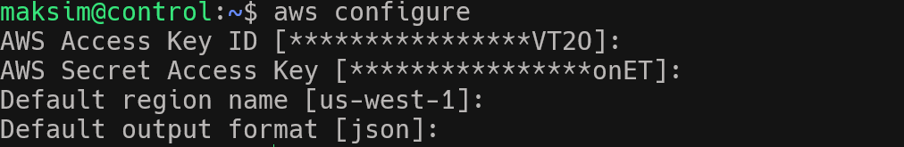
2. Устанавливаю boto3 библиотеку для Python
      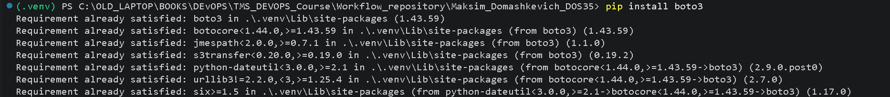
3. Запускаю файл s3boto.py для создания S3 бакета и проверяю наличие в портале AWS.
      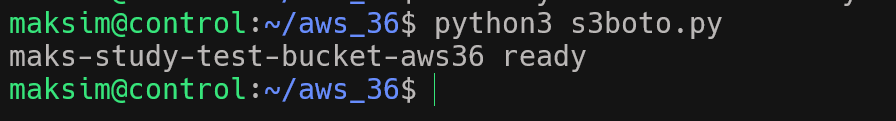
      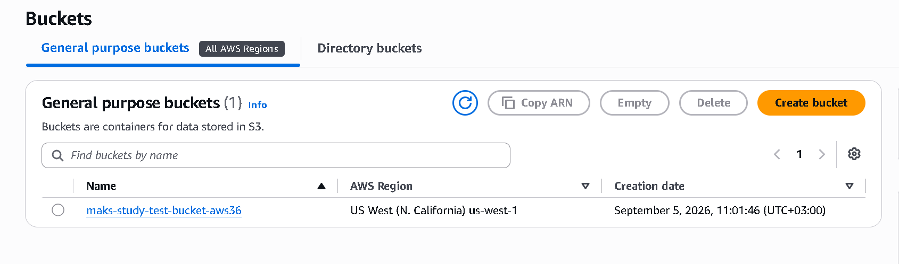
4. Создаю файл на серверре и добавляю код для переноса файла с локального сервера на бакет
      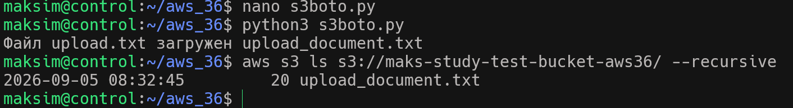
      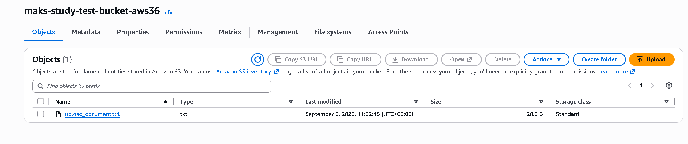   
5. Проверяю текущие права доступа для файла 
      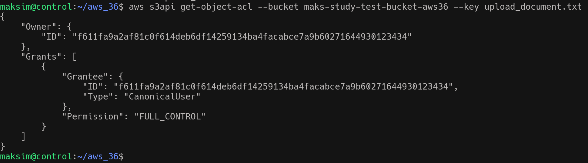
6. Добавляю в новые ACL настройки для файла в код скрипта 
 (PS: AWS в современных бакетах отключает ACL по умолчанию, заменяя их на политики IAM/Bucket Policies)
      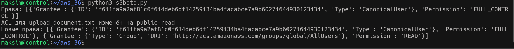
7. Cкачиваю c через CLI файл с AWS бакета.
      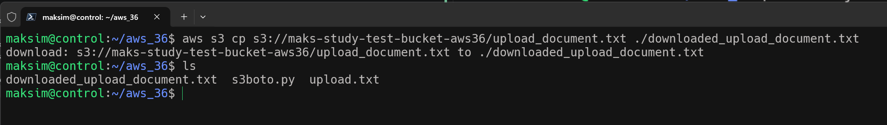         
8. Удаляю файлы и бакет с AWS 
      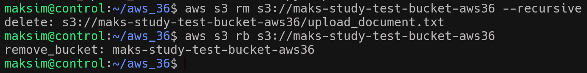    
      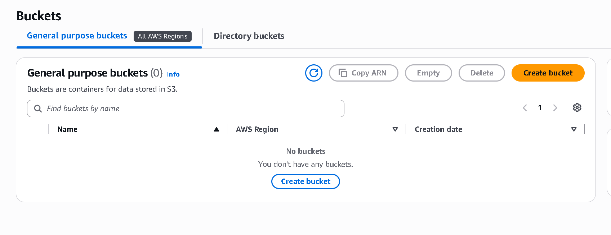    
