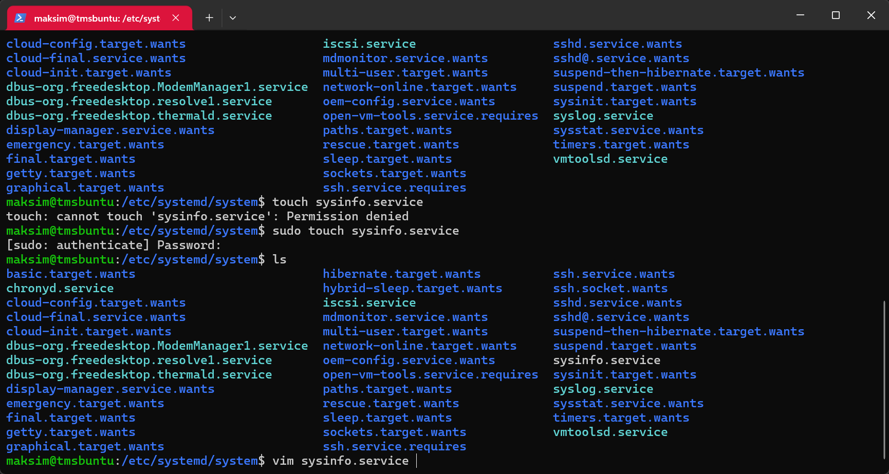
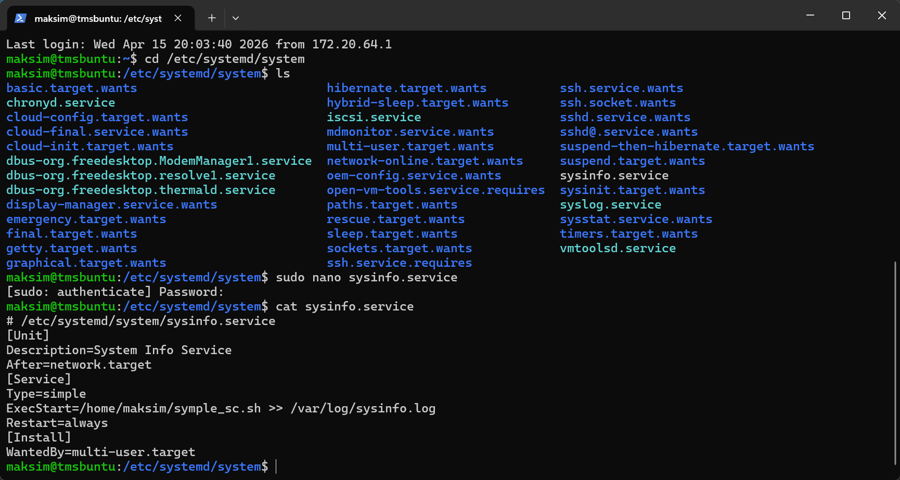
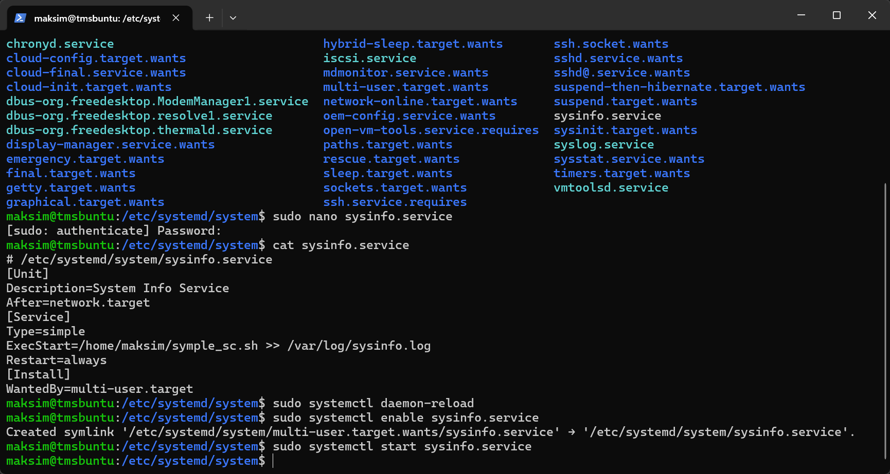
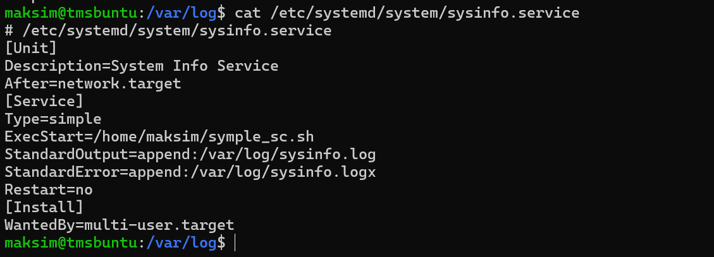
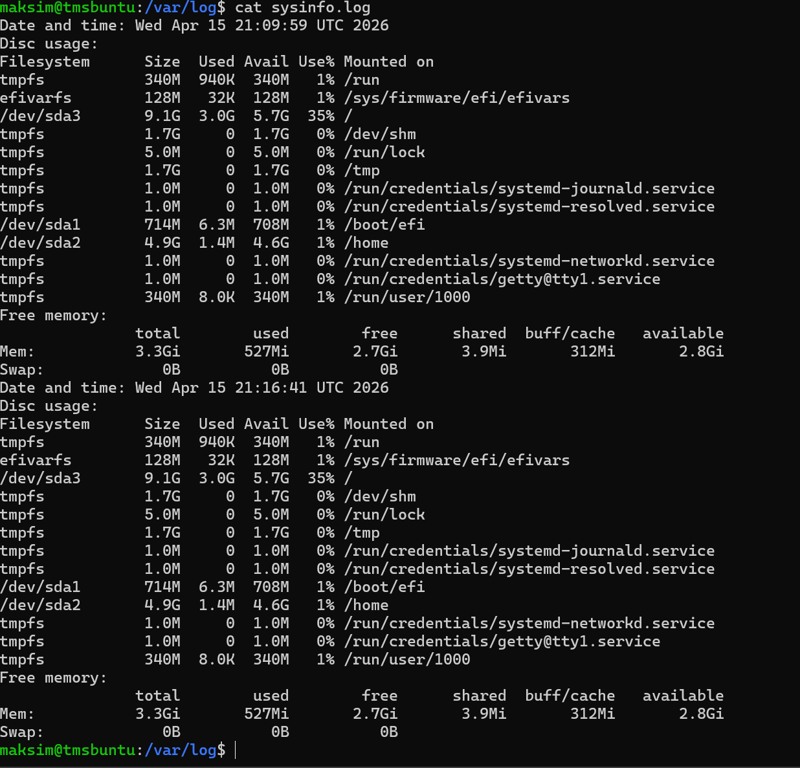

## Работа с сервером Linux основы BASH 

1. Создаю простой скрипт на Bash symple_sc.sh
              
2. Переношу файл на сервер и прописываю разрешения для запуска и запускаю скрипт 
         
3. Создаю скрипт на установку пакета програм
    * htop для мониторинга процессов
    * mc (Midnight Commander) для работы с файлами
    * tree для просмотра структуры каталогов
    * и дополнительно выборку и создание файла установленных программ 
        dpkg --get-selections > installed_packages.txt  
         

4. Повторяю процедуру из пункта 2 и запускаю скрипт
         
5. Скриптом создаю дополнительно файл installed_packages.txt      
         
    проверяю содержимое файла после команды    
          

### Сервис 
 Создаю сервис который 
   * Запускает скрипт symple_sc.sh
   * Записывает результаты в лог
   * Автоматически стартует при загрузке системы                    
1. Создаю файл sysinfo.service в папке /etc/systemd/system/ на VM Ubuntu
         
2. Добавляю необходимые данные в файл            
         
3. Запускаю команды aктивации службы
                        
4. Проверяю статус службы
              
5. Перезагружаю server и смотрю результат записи в лог и статус сервиса 
     результат сервис не работает 
     путем проверок и поиска в интернете был весен ряд правок в результате сервис стал выглядеть 
                 
6. Перезагружаю службу и получаю лог файл 
                 