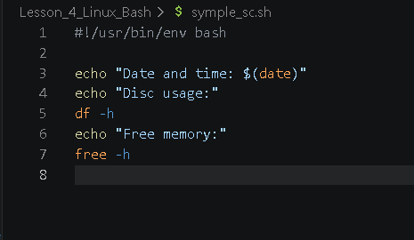
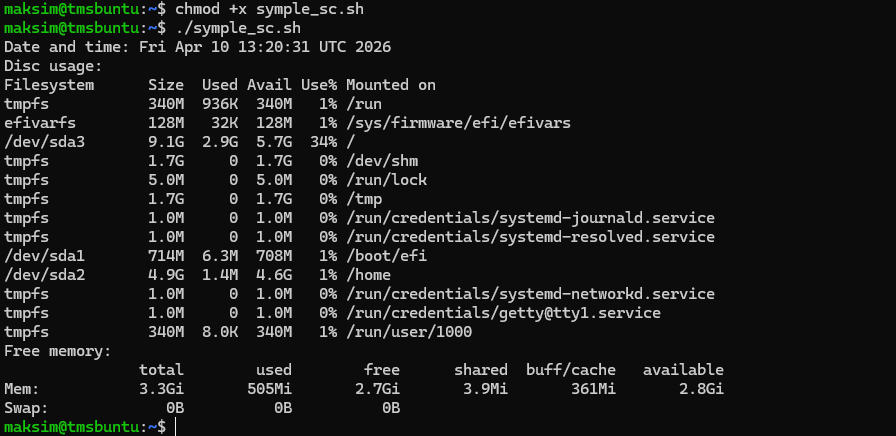
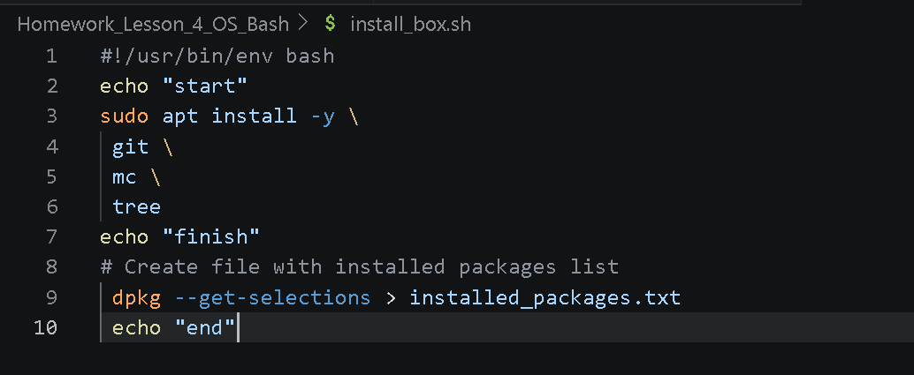
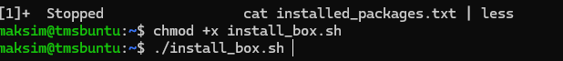
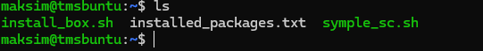
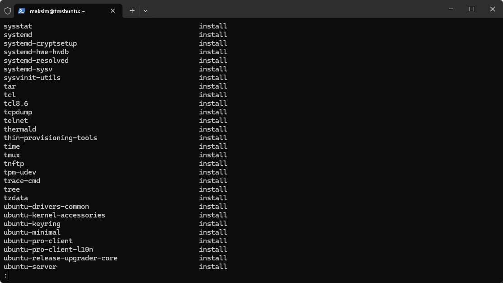

## Работа с сервером Linux основы BASH 

1. Создаю простой скрипт на Bash symple_sc.sh
              
2. Переношу файл на сервер и прописываю разрешения для запуска и запускаю скрипт 
         
3. Создаю скрипт на установку пакета програм
    * htop для мониторинга процессов
    * mc (Midnight Commander) для работы с файлами
    * tree для просмотра структуры каталогов
    * и дополнительно выборку и создание файла установленных программ 
        dpkg --get-selections > installed_packages.txt  
         

4. Повторяю процедуру из пункта 2 и запускаю скрипт
         
5. Скриптом создаю дополнительно файл installed_packages.txt      
         
    проверяю содержимое файла после команды    
                     

      

