## Создание Virtual mashine (Linux) и установка правил соединения через SSH

     -  Создайте 2 виртаульных машины (далее - VM1, VM2. Вы можете дать любое удобное вам название). Используйте образ ubuntu24.10
     -  Пройдите польностью все этапы установки и вручную разбейте свободное пространство на диски.
     -  Настройте SSH-соеденение следующим образом: хостовая ОС -> VM1, VM1 -> хостовая ос, VM2 -> VM1, VM2 -x> хостовая ОС. Запрет соеденения можно осуществить любым удобной полиси через iptables.
     * с помощью инструмента Hashicorp Packer создайте образы двух виртуальных машин с заранее подготовленными предустановками, описанными выше. Должно быть 2 конфига.
  
1. Создание вручную было сделано и описано в *_Homework_Lesson_3_OS_P1_* 
2. Создаю две виртуальные машины и задаю хостовую машину и виртуальные в рамках одной виртуальной сети 
    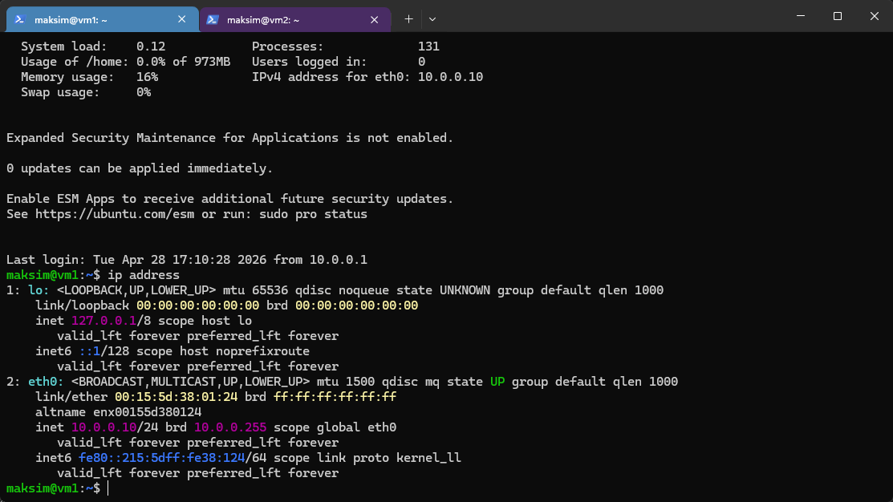
    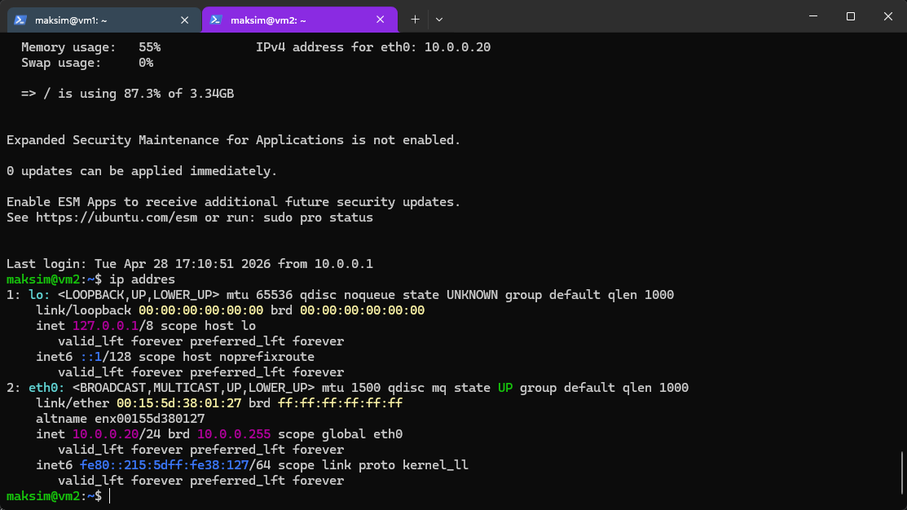
    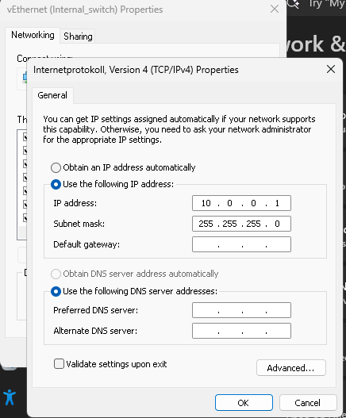 
3. Пингую с хостовой машины виртуалки для проверки их доступности 
    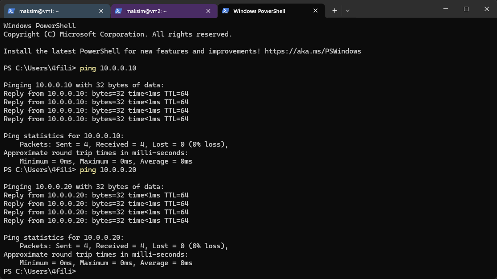
   Проверяю возможности SSH подключения  с VM_1 на хостовую и VM_2
    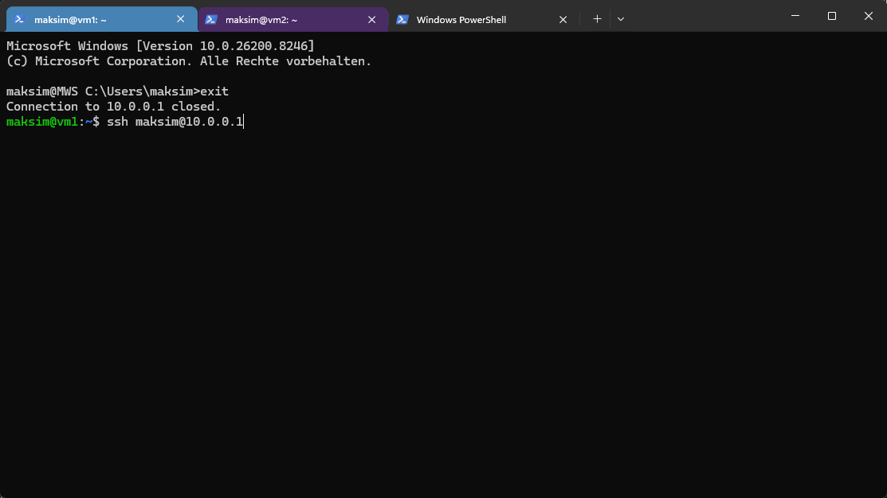    
    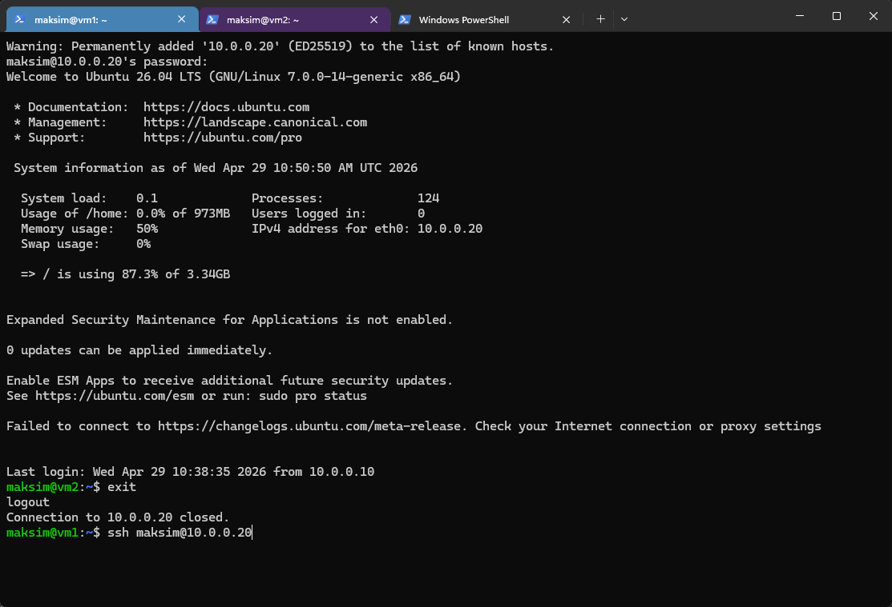
4. Прописываю правила в раздел IPtables для VM1 
    - Разрешаем входящее подключение SSH от хостовой ОС (10.0.0.1) и VM2 (10.0.0.20)
    - Разрешаем исходящее подключение SSH к хостовой ОС (10.0.0.1)
    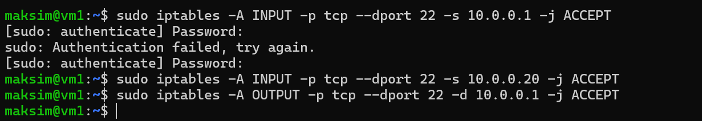  
  - Проверяем правила в Iptables 
    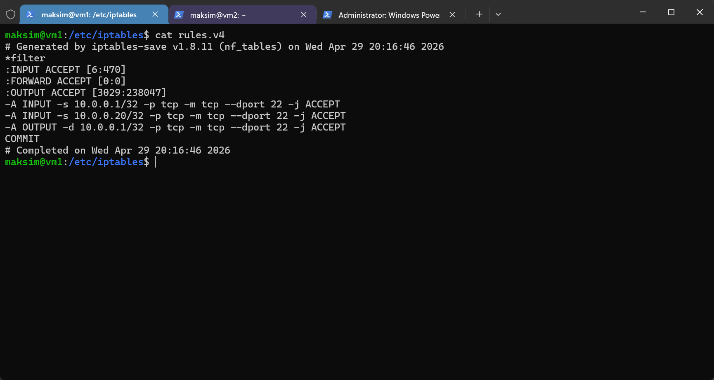      
5. Прописываю правила в раздел IPtables для VM2 
    - Разрешаем исходящее подключение SSH к VM_1 ОС (10.0.0.10) 
    - Запрещаем любое другое подключение SSH к VM_1
  - Проверяем правила в Iptables 
    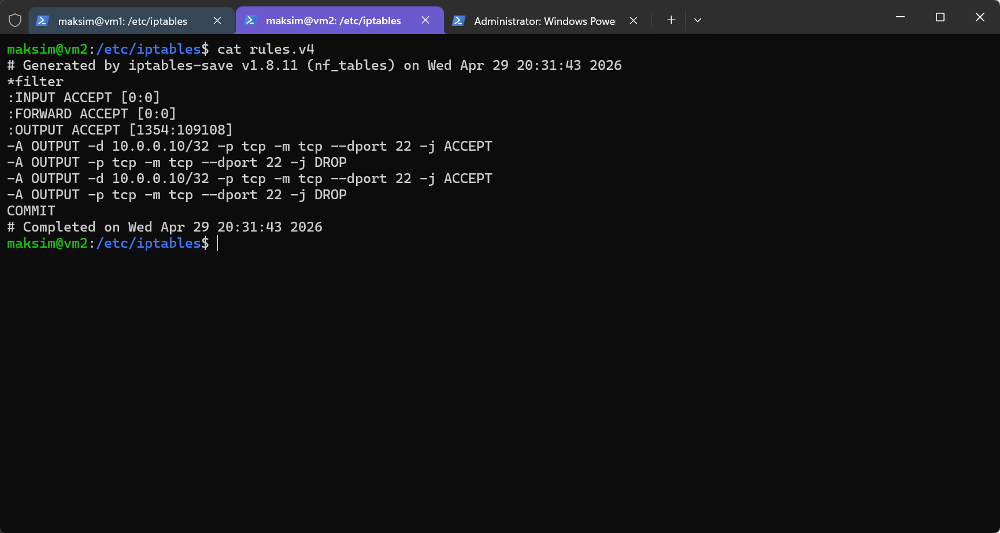 
6. Проверяем подключения
    -  Хост -> VM1
    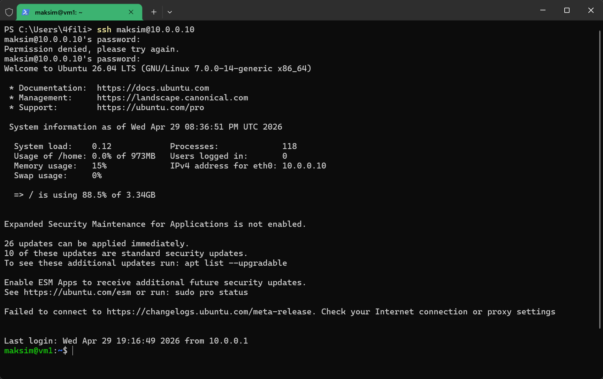
    -  VM1 -> Хост
    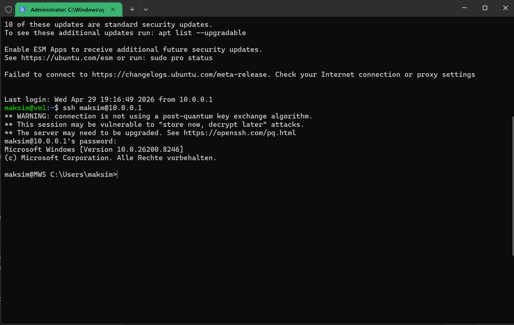
    -  Хост -> VM2
    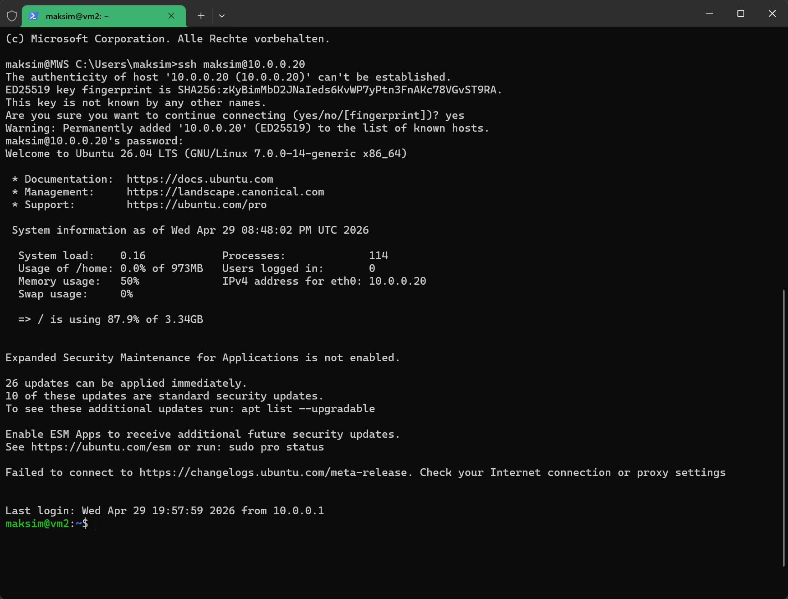        
    -  VM2 -> Хост
    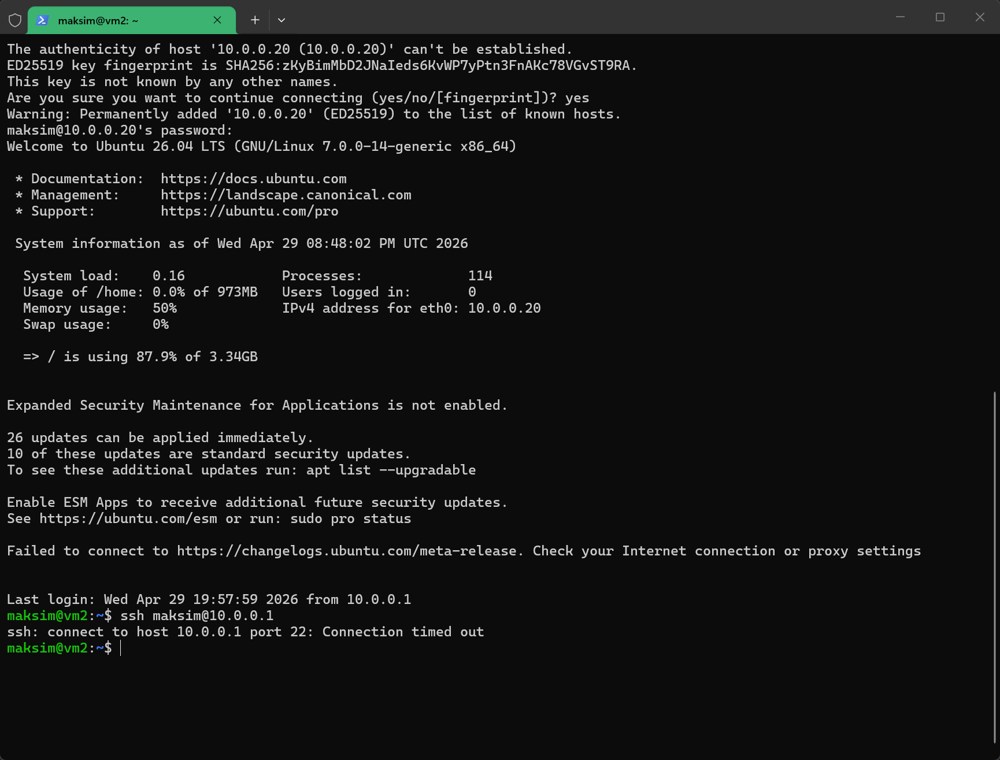   
    -  VM2 -> VM1
    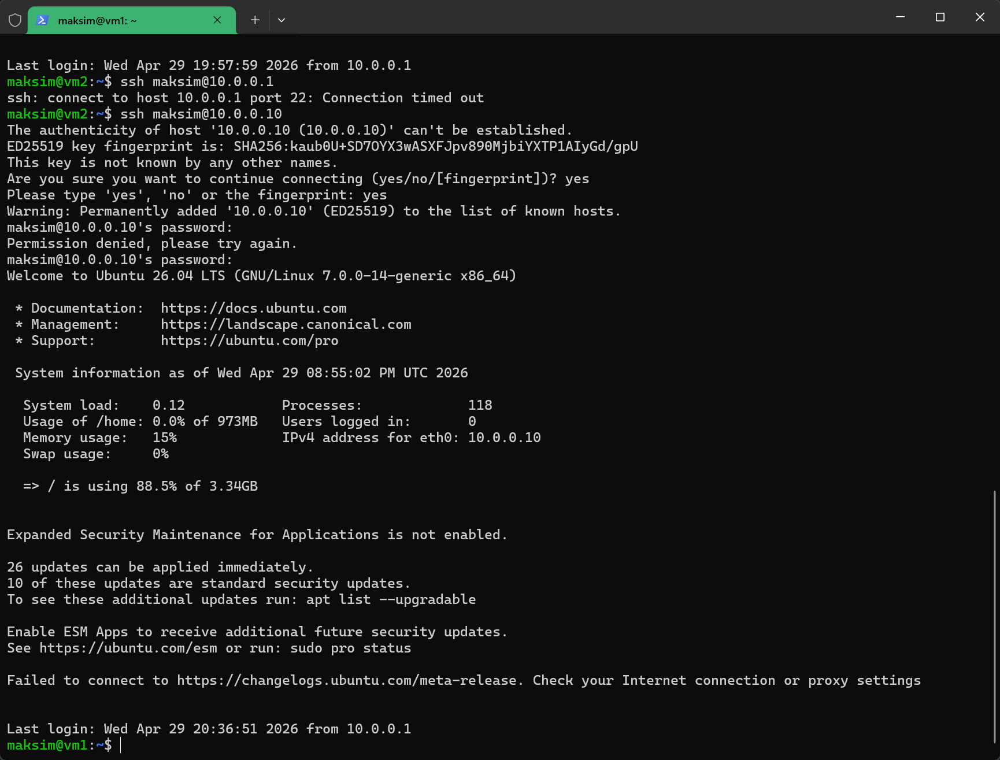   

<!-- 
1. Устанавливаю Packer прописываем пути в PATH проверяем, что программа доступна 
    
2. Создаю две папки для конфигураций двух VM машин Ubuntu instance 1 и instance 2 
3. Создаю два файла meta_data c названием instance и user_data который содержит блок        настроек внутри виртуальной машины  имя юзера сетевые настройки, разбивка диск  и доступ через публичный ключ SSH.
4. Помещаю эти файлы в соответствующие папки для VM 1 и VM 2 
5. Создаю файлы _config_instans-vm1.pkr.hcl_ и _config_instans-vm1.pkr.hcl_ которые непосредственно и управляют процессом создания, на так называемом языке HCL (HashiCorp Configuration Language), где  на основе файлов блоков данных и файлов meta_data и user_data. 
    Файл сожержит в себе информацию: 
    - архитектура: размер диска, колиичество выделенной памяти, количество ядер и сетевая карта 
    - откуда брать установочный образ
    - откуда брать плагины для работы в нашем случае HyperV
    - пути к SSH 
    - также в него можно поместить блок команд которые будут выпоолнены для виртуальной машины после установки
6. Размещаю файлы и папки в директории _packer_ubuntu_   
       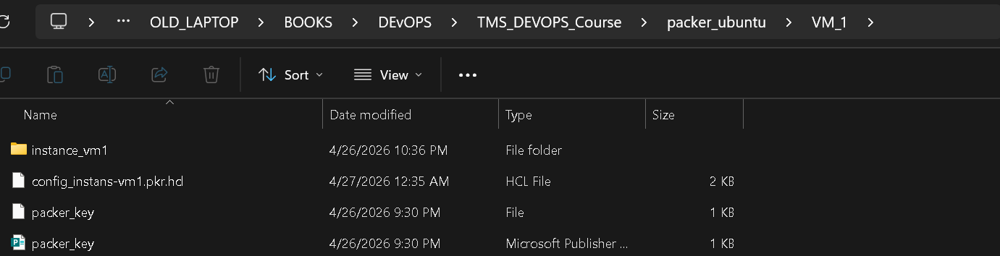
       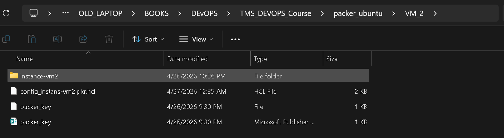
7.  Запускаю Терминал, перехожу в созданную папку и инициирую чтение содержимых файлов и конфигов и добавление плагина
       
 -->
