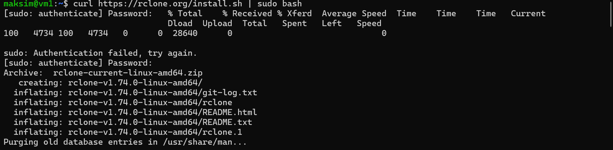
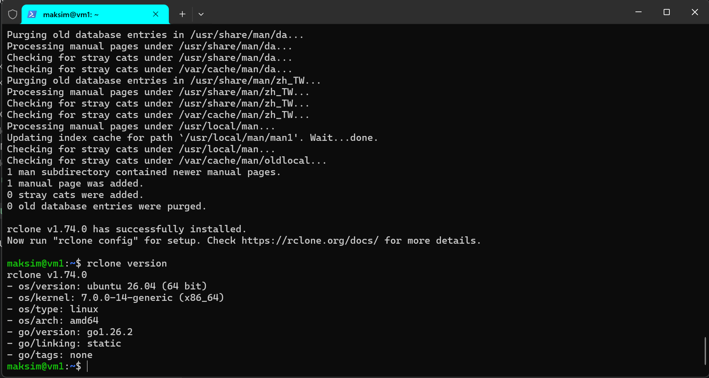
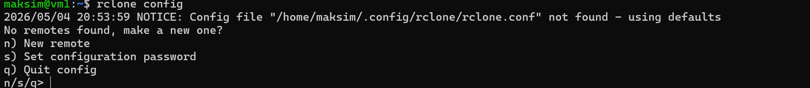
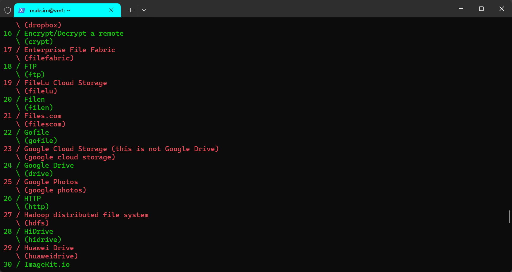
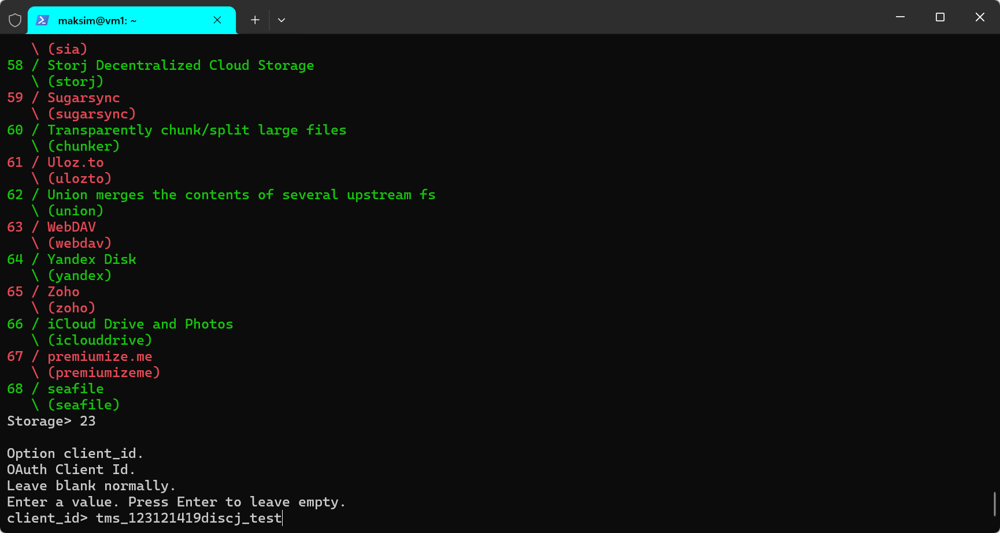

## Unix utilite
    Задача сделать синхронизацию с облачных хранилищем (S3, GCP Storage) c указанием NAME_SURNAME в имени папки 

1. Для работы по синхронизации с GCP storage оптимально будет испоьзовать Rclone.
2. Устанавливаю утилиту RCLONE на виртуальную машину
   
   
3. Создаю конфигурацию для GSP storage
   
   
   
4.ДОбавляем параметры коннекта