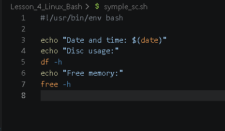
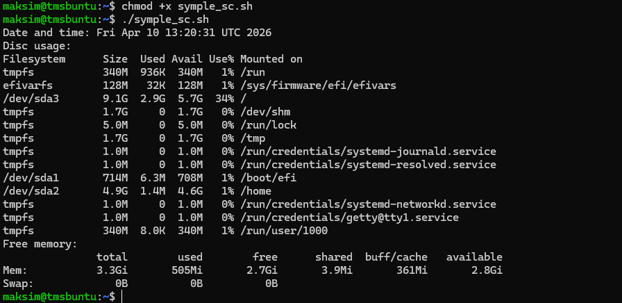
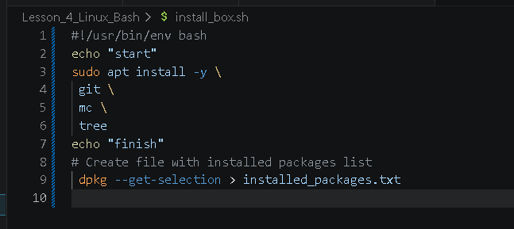
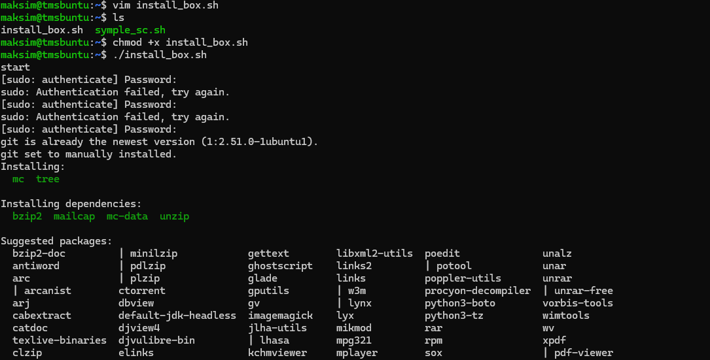
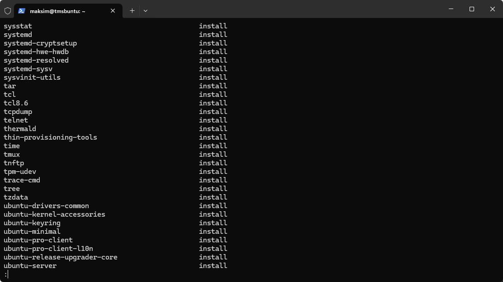

## Работа с сервером Linux основы BASH 

1. Создание и запуск простого скрита на Bash
     Создаем скрипт
         
2. Переносим скрипт на сервер 
    Прописываем разрешения для запуска и запускаем скрипт 
         
3. Пишем скрипт на установку пакета програм
    * htop для мониторинга процессов
    * mc (Midnight Commander) для работы с файлами
    * tree для просмотра структуры каталогов
4. Повторяем процедуру из путкта 2 и запускаем скрипт
         
         
    скриптом создан дополнительно файл installed_packages.txt 
                     
    содержимое файла после команды 
    dpkg --get-selections > installed_packages.txt  
                     

